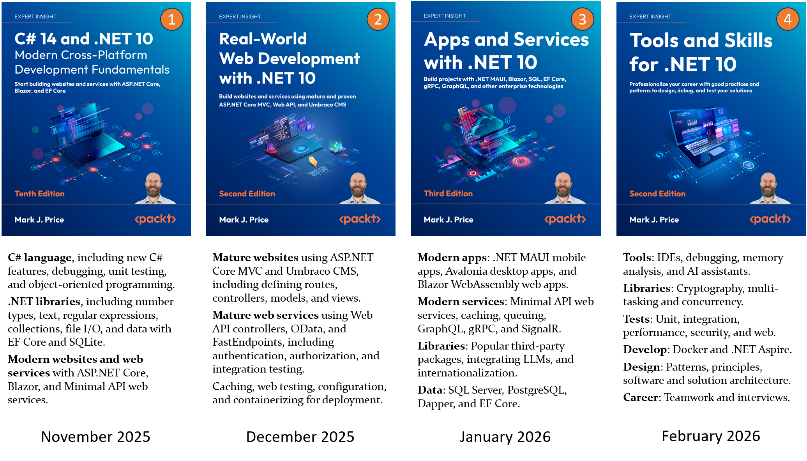

**FAQs**

- [Questions about book content](#questions-about-book-content)
  - [Is there a roadmap that shows what order to learn .NET technologies?](#is-there-a-roadmap-that-shows-what-order-to-learn-net-technologies)
  - [What order should I read your books?](#what-order-should-i-read-your-books)
  - [What's New in your .NET 10 books?](#whats-new-in-your-net-10-books)
  - [Do your books work with Linux?](#do-your-books-work-with-linux)
  - [A link is broken in one of your books. What could be the cause?](#a-link-is-broken-in-one-of-your-books-what-could-be-the-cause)
  - [Will there be editions of your books for future versions of .NET?](#will-there-be-editions-of-your-books-for-future-versions-of-net)
  - [Are there slide decks for your books for educational use?](#are-there-slide-decks-for-your-books-for-educational-use)
  - [How can a .NET developer study AI?](#how-can-a-net-developer-study-ai)
  - [Which IDE and OS are most popular for .NET developers?](#which-ide-and-os-are-most-popular-for-net-developers)
  - [What do recent surveys about .NET tell us?](#what-do-recent-surveys-about-net-tell-us)
- [Questions about book distribution and pricing](#questions-about-book-distribution-and-pricing)
  - [The roles and responsibilities for publishing a book](#the-roles-and-responsibilities-for-publishing-a-book)
  - [How to get a Packt book you have purchased as a PDF](#how-to-get-a-packt-book-you-have-purchased-as-a-pdf)
  - [Will I be able to download a newer copy or will I have to pay anything for the newer edition?](#will-i-be-able-to-download-a-newer-copy-or-will-i-have-to-pay-anything-for-the-newer-edition)
  - [Where can I buy your books in my country? When will a book be published in my country?](#where-can-i-buy-your-books-in-my-country-when-will-a-book-be-published-in-my-country)
  - [Can you give me a free copy of your book? Can you give me permission to read an illegal copy of your book?](#can-you-give-me-a-free-copy-of-your-book-can-you-give-me-permission-to-read-an-illegal-copy-of-your-book)

# Questions about book content

I can answer questions about the content of my books because I am the author.

## Is there a roadmap that shows what order to learn .NET technologies?

Some decent .NET road maps include: 
- https://roadmap.sh/aspnet-core
- https://github.com/MoienTajik/AspNetCore-Developer-Roadmap/blob/master/aspnetcore-developer-roadmap.png
- https://github.com/milanm/DotNet-Developer-Roadmap?tab=readme-ov-file#roadmap

## What order should I read your books?

I have written articles to answer this here: 
- [What order should I read your .NET 10 books?](articles/book-sequence-net10.md)
- [What order should I read your .NET 8 and .NET 9 books?](articles/book-sequence.md)

## What's New in your .NET 10 books?

I have written an article about this here: [What's New in your .NET 10 books?](articles/whats-new-in-net10-books.md).

## Do your books work with Linux?

A reader asked, "Im linux user, but I want to learn about net development; but need to confirm if this book all the content is possible working in linux. All exercises and practices."

Modern .NET including its SDK is cross-platform, running on Windows, Mac, and Linux. Although Visual Studio 2026 is Windows-only, either VS Code or JetBrains Rider run on Linux. All the content in my books specifically about Visual Studio 2026 obviously won't work on Linux. But all the content that is the actual coding exercises can be completed on Linux. You just won't see code editor screenshots or detailed steps for Linux in my book. Linux users tend to be more advanced than Windows users so that should not be a problem. 

Install .NET on Linux: https://learn.microsoft.com/en-us/dotnet/core/install/linux

The only parts of the .NET SDK that are Windows-only are Windows Forms and Windows Presentation Foundation (WPF), both used for Windows desktop apps. They are not in any of my books because they are not cross-platform.

## A link is broken in one of your books. What could be the cause?

Here are the main causes of broken links:
1. The link is broken because of a typo that snuck past the editing process or the original website has changed. Please let me know the page number, section title, and link, and I will add an errata for it to the book's GitHub repository, and I will change it in the next edition.
2. If you click the link and it fails, it could be that your PDF reader has a bug. For example, **SumatraPDF** is known to have issues with links that span multiple lines, as you can read about at the following issue: https://github.com/markjprice/cs13net9/issues/86. Please let me know the PDF reader that you used and I will add it to a list to avoid.
3. You selected the link text and copied it to the clipboard, then pasted the link into your browser's address bar:
  - It could be that you selected too little or too much. For example, the copyeditors for Packt like to add a period (full-stop) to the end of links. Although that character is not part of the link if you click it, when copying and pasting, you might select it, breaking the link.
  - Most PDF readers try to be smart about copying and pasting links that contain hyphens. They assume that a hyphen at the end of a line that continues to the next line is a hyphen that should be removed when pasting. So the following link:
```
   https://www.microsoft.com/a-long-
   link-with-hyphens
```
   - Would be pasted as: `https://www.microsoft.com/a-longlink-with-hyphens`. Note the hyphen between `long` and `link` has been automatically stripped by the PDF reader. Always check the link in the address bar after pasting if you get a 404. Look for missing hyphens (dashes) and extra dots at the end.

PDF readers with known link issues:
- **SumatraPDF**

## Will there be editions of your books for future versions of .NET?

Starting in November 2025, all four .NET books will be updated for .NET 10, as shown in the following figure and described in the numbered bullets:



1.	The first book covers the fundamentals of the C# language, the .NET libraries, and modern ASP.NET Core technologies for web development. It is designed to be read linearly because skills and knowledge from earlier chapters build up and are needed to understand later chapters.
2.	The second book covers mature and proven web development technologies like ASP.NET Core MVC and controller-based Web API web services, as well as OData, FastEndpoints, and Umbraco CMS for building real-world web projects on .NET 10. You will learn how to test your web services using xUnit and test the user interfaces of your websites using Playwright, and then how to containerize your projects ready for deployment.
3.	The third book covers how to build graphical user interfaces for websites, desktop, and mobile apps with Blazor, Avalonia, and .NET MAUI respectively. Then you will learn more specialized library topics like internationalization and popular third-party packages including Serilog and NodaTime. You will learn how to build native AOT-compiled services with ASP.NET Core Minimal API and how to improve performance, scalability, and reliability using caching, queues, and background services. You will implement more services using GraphQL, gRPC, and SignalR, as well as learn how to integrate LLMs to add intelligence to your solutions. 
4.	The fourth book covers important tools and skills for a professional .NET developer. These include design patterns and solution architecture, debugging, memory analysis, all the important types of testing whether unit, performance, or web and mobile, and then containerization for deployment topics like Docker and Aspire. Finally, the book looks at how to prepare for an interview to get the .NET developer career that you want.

## Are there slide decks for your books for educational use?

No, I have not created slide decks to match the content of my books. I have had only three requests for slide decks from teachers over the past ten years so that they can more easily use my books in their courses so there isn't enough demand to make it worthwhile. But if any teachers want to contact me to discuss what a slide deck would need to look like to be useful to them, then please contact me (markjprice@gmail.com) and we can arrange a video call to discuss details and perhaps I will do something for the .NET 10 edition.

## How can a .NET developer study AI?

In the Discord channel for *Tools and Skills for .NET 8*, **CarlosBazanH** / `_carlosbazan` asked, "Hi Mark, could you recommend how a .Net developer can study AI? Where can we start? Tools, skills, etc., using .Net as the backbone."

I have written an article about this here: [How can a .NET developer study AI?](articles/dotnet-and-ai.md).

## Which IDE and OS are most popular for .NET developers?

I have written an article about this here: [IDE and OS Usage Among .NET Developers (2023–2025)](articles/ide.md).

## What do recent surveys about .NET tell us?

I have written an article about this here: [What do recent surveys about .NET tell us?](articles/surveys.md).

# Questions about book distribution and pricing

If you purchased a book from a retailer like Amazon and have an issue with that purchase then contact the retailer.

For questions about book pricing, distribution, and so on, please contact the publisher, Packt, at the following email address: customercare@packt.com

## The roles and responsibilities for publishing a book

I am surprised when readers contact me about issues that I have no control over. Here's a summary of the main roles involved with publishing a book so that you can direct your emails appropriately:

- **Author**: The author is the creator of the book’s content and often the driving force behind its vision. I also try to support my readers through the GitHub repository issues page and the Discord channel for each book. I prioritize answering public posts above private emails because public posts benefit all my readers.
- **Publisher**: The publisher manages the production, financing, and overall project direction for the book. The publisher handles editing, cover design, distribution, and marketing. The publisher owns the copyright (intellectual property) and handles legal matters. The publisher coordinates with distributors and retailers, and sets pricing, discount rates, and release schedules. You can contact my publisher at: customercare@packt.com
- **Retailer**: The retailer is where readers actually buy the book, either physically or digitally. The retailer follows publisher pricing guidelines but can adjust prices, especially online. Mega retailers like Amazon have more control over the price you pay than the publisher. 

## How to get a Packt book you have purchased as a PDF

> **.NET 10 and later**: Newer editions can visit https://packtpub.com/unlock, then use the search bar to find this book by name. Double-check the edition shown to make sure you get the right one.

My .NET 10 books on Packt's website:
- [C# 14 and .NET 10 – Modern Cross-Platform Development Fundamentals](https://www.packtpub.com/en-us/product/c-14-and-net-10-modern-cross-platform-development-fundamentals-9781836206637)
- [Real-World Web Development with .NET 10](https://www.packtpub.com/en-us/product/real-world-web-development-with-net-10-9781835888926)
- [Apps and Services with .NET 10](https://www.packtpub.com/en-us/product/apps-and-services-with-net-10-9781835462201)
- [Tools and Skills for .NET 10](https://www.packtpub.com/en-us/product/tools-and-skills-for-net-10-9781835882504)

For older editions, you have two options to get a Packt book in PDF format:

1. If you purchase any other format of the book from anywhere else then you can get the PDF edition by completing a form on Packt's website with proof of purchase: https://www.packtpub.com/page/free-ebook. For example, you might buy the paperback from your local independent bookstore, or you might buy the Kindle edition from Amazon.

2. If you purchase an ebook from Packt's website then you get it in PDF and EPUB formats as well as their online reader. 

My .NET 9 books on Packt's website:
- [C# 13 and .NET 9 – Modern Cross-Platform Development Fundamentals](https://www.packtpub.com/en-us/product/c-13-and-net-9-modern-cross-platform-development-fundamentals-9781835881224)
- [Real-World Web Development with .NET 9](https://www.packtpub.com/en-us/product/real-world-web-development-with-net-9-9781835880395)

My .NET 8 books on Packt's website:
- [C# 12 and .NET 8 – Modern Cross-Platform Development Fundamentals](https://www.packtpub.com/en-us/product/c-12-and-net-8-modern-cross-platform-development-fundamentals-9781837635870)
- [Apps and Services with .NET 8](https://www.packtpub.com/en-us/product/apps-and-services-with-net-8-9781837637133)
- [Tools and Skills for .NET 8](https://www.packtpub.com/en-us/product/tools-and-skills-for-net-8-9781837635207)

## Will I be able to download a newer copy or will I have to pay anything for the newer edition?

Readers must pay for individual new editions. Some publishers offer subscription services to get access to new editions. For example, Packt Subscription: https://www.packtpub.com/subscribe

## Where can I buy your books in my country? When will a book be published in my country?

Similar questions:

- Only the Kindle edition is available to purchase from Amazon in my country. When will the paperback be published?

The publisher, Packt, handles distribution deals around the world. I live in the UK and I have no experience with buying books in your country but you probably do. Where have you bought books before in your country? Most bookstores will order a book for you if they do not have it in stock. If they cannot, then please ask the publisher, Packt, where you can buy Packt books in your country and when a book will be published there: customercare@packt.com. 

When a book is published, it often takes several days or even weeks before it is available in all formats in all countries. Usually you can order a book in both Kindle and paperback on the date of publishing from Amazon USA. Other countries will typically allow Kindle orders on the same day, but paperback orders may take longer. Regardless, as the author I have no insight into specifics. Please contact the publisher Packt and ask them: customercare@packt.com. 

## Can you give me a free copy of your book? Can you give me permission to read an illegal copy of your book?

I often get questions from readers that are actually about the intellectual property ownership of the books that I author:

- Can you give me a free copy of your book? 
- Can you give me permission to read an illegal copy of your book?
- Can I promote your book via an affiliate program?
- Can I create a YouTube channel using your book as reference?

Some readers think that because my name is on the front cover, that means the books that I author are "mine". When an author uses a phrase like "my book", what they most commonly mean is "books that I author", not "books that I own the intellectual property for". 

Inside each book cover you will see who actually owns the book. For example, for my tenth edition: **Copyright &copy; 2025 Packt Publishing**, as shown in the figure below: 


Authors who work with publishers just write the content. Authors are not involved in pricing and distribution, and they certainly cannot give the books away for free, or give you permission to read the books without paying for them. Authors also cannot give you permission to create new works based on Packt's books (intellectual property) or join a revenue sharing scheme or affiliate program. 
