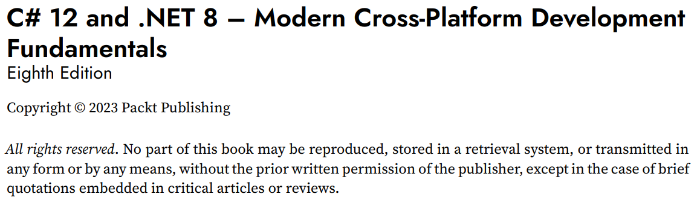

**FAQs**

- [Questions about book content](#questions-about-book-content)
  - [Is there a roadmap that shows what order to learn .NET technologies?](#is-there-a-roadmap-that-shows-what-order-to-learn-net-technologies)
  - [What order should I read your books?](#what-order-should-i-read-your-books)
  - [What's New in your .NET 10 books?](#whats-new-in-your-net-10-books)
  - [Will there be editions of your books for future versions of .NET?](#will-there-be-editions-of-your-books-for-future-versions-of-net)
  - [Are there slide decks for your books for educational use?](#are-there-slide-decks-for-your-books-for-educational-use)
  - [How can a .NET developer study AI?](#how-can-a-net-developer-study-ai)
  - [Which IDE and OS are most popular for .NET developers?](#which-ide-and-os-are-most-popular-for-net-developers)
  - [What do recent surveys about .NET tell us?](#what-do-recent-surveys-about-net-tell-us)
- [Questions about book distribution and pricing](#questions-about-book-distribution-and-pricing)
  - [How to get a Packt book you have purchased as a PDF](#how-to-get-a-packt-book-you-have-purchased-as-a-pdf)
  - [Will I be able to download a newer copy or will I have to pay anything for the newer edition?](#will-i-be-able-to-download-a-newer-copy-or-will-i-have-to-pay-anything-for-the-newer-edition)
  - [Where can I buy your books in my country? When will a book be published in my country?](#where-can-i-buy-your-books-in-my-country-when-will-a-book-be-published-in-my-country)
  - [Can you give me a free copy of your book? Can you give me permission to read an illegal copy of your book?](#can-you-give-me-a-free-copy-of-your-book-can-you-give-me-permission-to-read-an-illegal-copy-of-your-book)

# Questions about book content

I can answer questions about the content of my books because I am the author.

## Is there a roadmap that shows what order to learn .NET technologies?

Some decent .NET road maps include: 
- https://github.com/milanm/DotNet-Developer-Roadmap
- https://roadmap.sh/aspnet-core
- https://github.com/MoienTajik/AspNetCore-Developer-Roadmap/blob/master/aspnetcore-developer-roadmap.png

## What order should I read your books?

I have written an article about this here: [What order should I read your books?](articles/book-sequence.md).

## What's New in your .NET 10 books?

I have written an article about this here: [What's New in your .NET 10 books?](articles/whats-new-in-net10-books.md).

## Will there be editions of your books for future versions of .NET?

I have updated my C# and .NET fundamentals book and created a new book for web development that both cover .NET 9, but I will not be updating my *Apps and Services* or *Tools and Skills* books for .NET 9. Until the end of 2025, the most up-to-date editions of my .NET books are shown in the following figure:

Starting in November 2025, my plan* is that all four .NET books will be updated for .NET 10, as shown in the following figure and described in the numbered bullets:

1.	The first book covers the fundamentals of the C# language, the .NET libraries, and modern ASP.NET Core technologies for web development. It is designed to be read linearly because skills and knowledge from earlier chapters build up and are needed to understand later chapters.
2.	The second book covers mature and proven web development technologies like ASP.NET Core MVC and controller-based Web API web services, as well as OData, FastEndpoints, and Umbraco CMS for building real-world web projects on .NET 10. You will learn how to test your web services using xUnit and test the user interfaces of your websites using Playwright, and then how to containerize your projects ready for deployment.
3.	The third book covers how to build graphical user interfaces for websites, desktop, and mobile apps with Blazor, Avalonia, and .NET MAUI respectively. Then you will learn more specialized library topics like internationalization and popular third-party packages including Serilog and NodaTime. You will learn how to build native AOT-compiled services with ASP.NET Core Minimal API and how to improve performance, scalability, and reliability using caching, queues, and background services. You will implement more services using GraphQL, gRPC, and SignalR, as well as learn how to integrate LLMs to add intelligence to your solutions. 
4.	The fourth book covers important tools and skills for a professional .NET developer. These include design patterns and solution architecture, debugging, memory analysis, all the important types of testing whether unit, performance, or web and mobile, and then containerization for deployment topics like Docker and Aspire. Finally, the book looks at how to prepare for an interview to get the .NET developer career that you want.

*Plan not guaranteed!

## Are there slide decks for your books for educational use?

No, I have not created slide decks to match the content of my books. I have had only three requests for slide decks from teachers over the past ten years so that they can more easily use my books in their courses so there isn't enough demand to make it worthwhile. But if any teachers want to contact me to discuss what a slide deck would need to look like to be useful to them, then please contact me (markjprice@gmail.com) and we can arrange a video call to discuss details and perhaps I will do something for the .NET 10 edition.

## How can a .NET developer study AI?

In the Discord channel for *Tools and Skills for .NET 8*, **CarlosBazanH** / `_carlosbazan` asked, "Hi Mark, could you recommend how a .Net developer can study AI? Where can we start? Tools, skills, etc., using .Net as the backbone."

I have written an article about this here: [How can a .NET developer study AI?](articles/dotnet-and-ai.md).

## Which IDE and OS are most popular for .NET developers?

I have written an article about this here: [IDE and OS Usage Among .NET Developers (2023–2025)](articles/ide.md).

## What do recent surveys about .NET tell us?

I have written an article about this here: [What do recent surveys about .NET tell us?](articles/surveys.md).

# Questions about book distribution and pricing

For questions about book pricing, distribution, and so on, please contact the publisher, Packt, at the following email address: customercare@packt.com

## How to get a Packt book you have purchased as a PDF

You have two options to get a Packt book in PDF format:

1. If you purchase any other format of the book from anywhere else then you can get the PDF edition by completing a form on Packt's website with proof of purchase: https://www.packtpub.com/page/free-ebook. For example, you might buy the paperback from your local independent bookstore, or you might buy the Kindle edition from Amazon.

2. If you purchase an ebook from Packt's website then you get it in PDF and EPUB formats as well as their online reader. 

My .NET 9 books on Packt's website:
- [C# 13 and .NET 9 – Modern Cross-Platform Development Fundamentals](https://www.packtpub.com/en-us/product/c-13-and-net-9-modern-cross-platform-development-fundamentals-9781835881224)
- [Real-World Web Development with .NET 9](https://www.packtpub.com/en-us/product/real-world-web-development-with-net-9-9781835880395)

My .NET 8 books on Packt's website:
- [C# 12 and .NET 8 – Modern Cross-Platform Development Fundamentals](https://www.packtpub.com/en-us/product/c-12-and-net-8-modern-cross-platform-development-fundamentals-9781837635870)
- [Apps and Services with .NET 8](https://www.packtpub.com/en-us/product/apps-and-services-with-net-8-9781837637133)
- [Tools and Skills for .NET 8](https://www.packtpub.com/en-us/product/tools-and-skills-for-net-8-9781837635207)

## Will I be able to download a newer copy or will I have to pay anything for the newer edition?

Readers must pay for individual new editions. Some publishers offer subscription services to get access to new editions. For example, Packt Subscription: https://www.packtpub.com/subscribe

## Where can I buy your books in my country? When will a book be published in my country?

The publisher, Packt, handles distribution deals around the world. I live in the UK and I have no experience with buying books in your country but you probably do. Where have you bought books before in your country? Most bookstores will order a book for you if they do not have it in stock. If they cannot, then please ask the publisher, Packt, where you can buy Packt books in your country and when a book will be published there: customercare@packt.com. 

## Can you give me a free copy of your book? Can you give me permission to read an illegal copy of your book?

Some readers think that because my name is on the front cover, that means the books are "mine". Inside the book cover you will see who owns the book: **Copyright &copy; 2023 Packt Publishing**, as shown in the figure below: 

Authors with publishers just write the content. Authors are not involved in pricing and distribution, and they certainly cannot give the books away for free, or give you permission to read the books without paying for them. 
