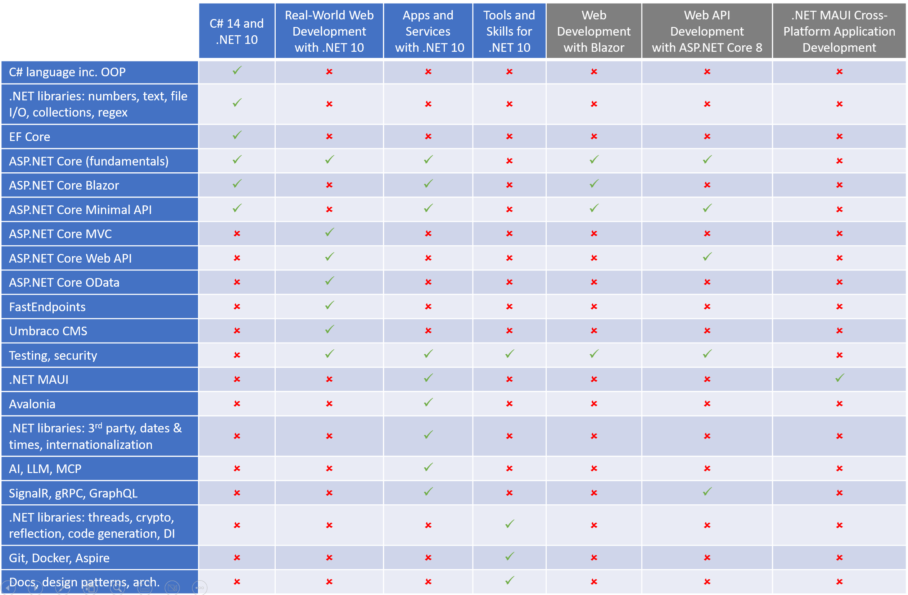
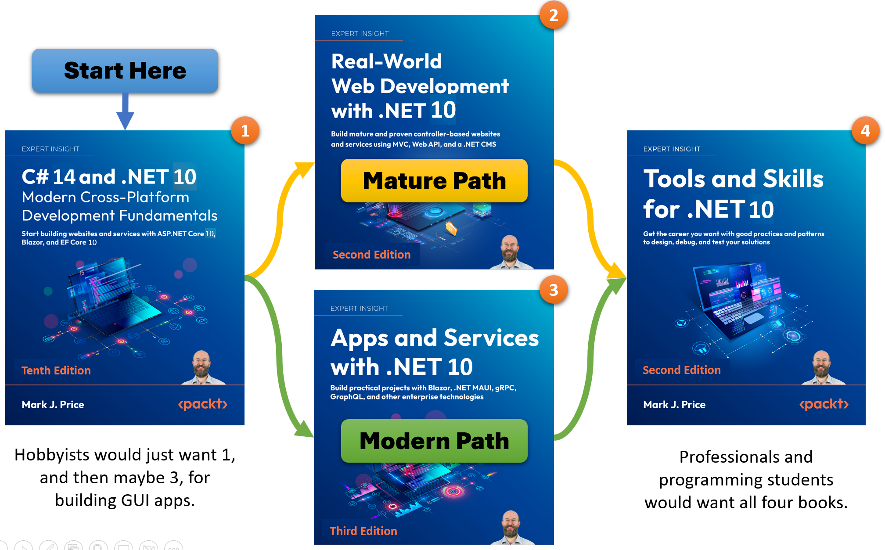

**What order should I read your .NET 9 and .NET 8 books?**

- [What are my .NET 8 and .NET 9 books?](#what-are-my-net-8-and-net-9-books)
- [Read the C# and .NET fundamentals first](#read-the-c-and-net-fundamentals-first)
- [What are your goals?](#what-are-your-goals)
- [Table of topics in my .NET 10 and other Packt books](#table-of-topics-in-my-net-10-and-other-packt-books)
- [Summary](#summary)

> **TLDR**; If you are new to .NET then read *C# 13 and .NET 9 - Modern Cross-Platform Development Fundamentals* first. After that, you can read any of the other books in any order.

# What are my .NET 8 and .NET 9 books?

I have published two books about .NET 9:

1. *C# 13 and .NET 9 - Modern Cross-Platform Development Fundamentals* [Amazon US](https://www.amazon.com/dp/183588122X/)
2. *Real-World Web Development with .NET 9* [Amazon US](https://www.amazon.com/dp/B0DK1KGH8R/)

I have published three books about .NET 8:

1. *C# 12 and .NET 8 - Modern Cross-Platform Development Fundamentals* [Amazon US](https://www.amazon.com/12-NET-Cross-Platform-Development-Fundamentals/dp/1837635870/)
2. *Apps and Services with .NET 8* [Amazon US](https://www.amazon.com/Apps-Services-NET-enterprise-technologies/dp/183763713X/)
3. *Tools and Skills for .NET 8* [Amazon US](https://www.amazon.com/Tools-Skills-NET-practices-solutions/dp/183763520X/)

# Read the C# and .NET fundamentals first

First, you need to learn:
1. **C# language** that provides the ability to write your programs and define your own classes for object-oriented programming.
2. **.NET base class library** that provides building blocks to implement common functionality like working with text and numbers, reading and writing files, and querying and managing data in relational databases.
3. **Modern web development** using ASP.NET Core, Blazor, and Minimal API to build websites and web services.

If you are already familiar with these topics then you can skip the fundamentals book. But I caution that even experienced .NET developers say they learn enough from this book to make it worth their time and money reading it. My more experienced readers tend to be the most enthusiastic about my work, because they can smoothly go through the stuff they mostly already know, picking up useful tips and filling in gaps in their often self-taught knowledge.

After learning the fundamentals of the language, libraries, and modern web development, you can read any of my other books in any order. Which order to read them is a personal choice and often depends on your goals.

# What are your goals?

Which book should you read next? It depends on your goals:
- If your goal is to learn to build websites and services using mature and proven .NET technologies used by enterprises and consultancies in the real world, then read *Real-World Web Development with .NET 9* next.
- If your goal is to learn more technologies to build modern .NET projects, or you mostly work on solo projects, then read *Apps and Services with .NET 8* next.
- If your goal is to become a professional .NET developer as quickly as possible, or you mostly work on team projects, then read *Tools and Skills for .NET 8* next.
- If your goal is to learn more details about architecting .NET projects, or implementing design patterns with ASP.NET Core, then you might be better off getting a book from another author like:
  - [Software Architecture with C# 12 and .NET 8](https://www.amazon.com/dp/1805127659/)
  - [Architecting ASP.NET Core Applications](https://www.amazon.com/Architecting-ASP-NET-Core-Applications-atypical/dp/1805123386/)
- If your goal is to build apps for your own use because you are a hobbyist or retiree, then you might be better off getting a book from another author like:
  - [.NET MAUI Cross-Platform Application Development](https://www.amazon.com/NET-MAUI-Cross-Platform-Application-Development/dp/1835080596/)
  - [The MVVM Pattern in .NET MAUI](https://www.amazon.com/dp/1805125001/)

# Table of topics in my .NET 10 and other Packt books

# Summary

