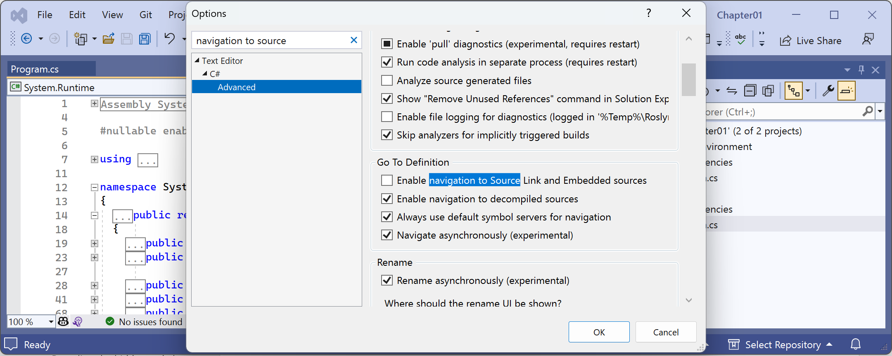
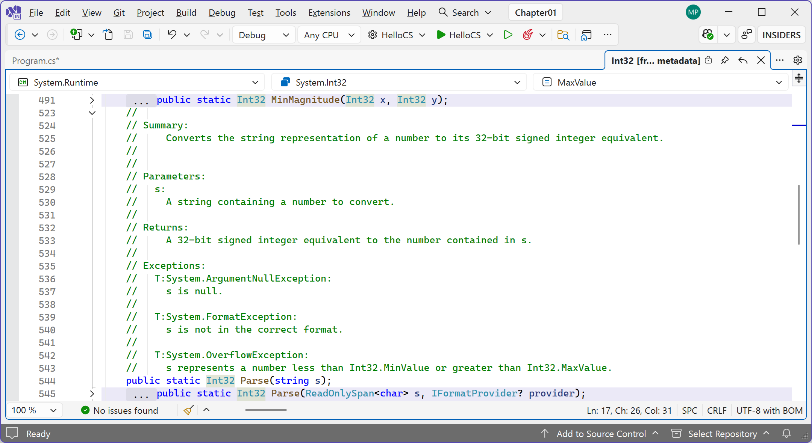
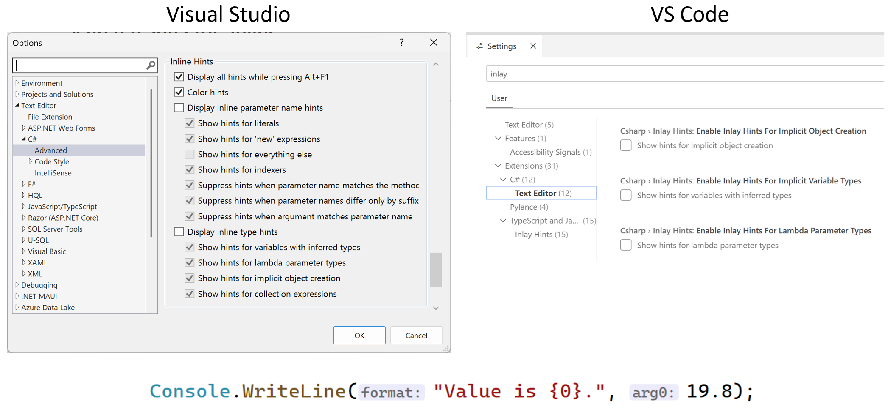
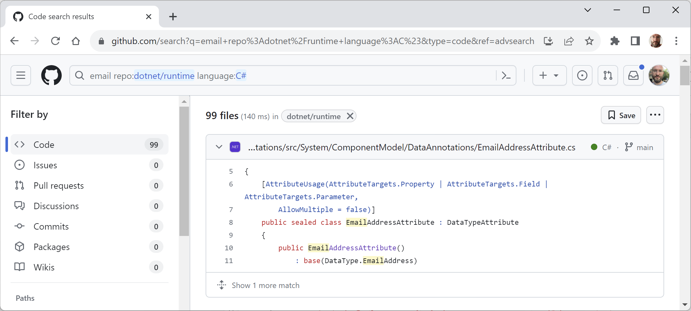
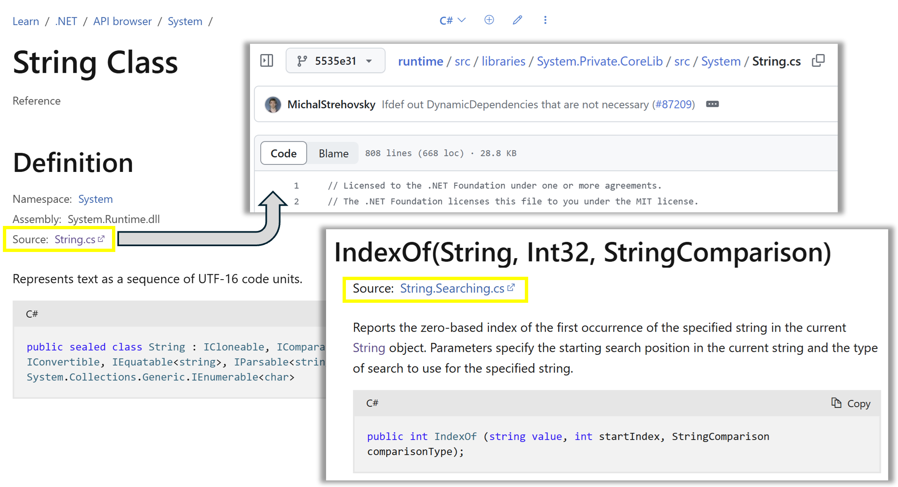

**Getting help**

- [Microsoft Learn documentation](#microsoft-learn-documentation)
- [Microsoft Learn documentation MCP server](#microsoft-learn-documentation-mcp-server)
- [Documentation links in this book](#documentation-links-in-this-book)
- [Getting help from the dotnet tool](#getting-help-from-the-dotnet-tool)
- [Getting definitions of types and their members](#getting-definitions-of-types-and-their-members)
- [Configuring inline aka inlay hints](#configuring-inline-aka-inlay-hints)
- [Searching for answers using Google](#searching-for-answers-using-google)
- [Getting help on Discord and other chat forums](#getting-help-on-discord-and-other-chat-forums)
- [Searching the .NET source code](#searching-the-net-source-code)
- [Source code in documentation](#source-code-in-documentation)
- [Official .NET blog, standups, and news](#official-net-blog-standups-and-news)
- [Watching Scott Hanselman’s videos](#watching-scott-hanselmans-videos)
- [AI tools like ChatGPT and GitHub Copilot](#ai-tools-like-chatgpt-and-github-copilot)
  - [Here is an example:](#here-is-an-example)
  - [applyTo: '\*\*/\*.cs'](#applyto-cs)
- [C# Development](#c-development)
  - [C# Instructions](#c-instructions)
  - [General Instructions](#general-instructions)
  - [Naming Conventions](#naming-conventions)


This section is all about how to find quality information about programming on the web.

# Microsoft Learn documentation

The definitive resource for getting help with Microsoft developer tools and platforms is in the technical documentation on Microsoft Learn, and you can find it at the following link: https://learn.microsoft.com/en-us/docs.

The Microsoft Learn documentation is comprehensive but overwhelming. It would be great if there were ways to interact with it beyond simple search. Ask Learn is one of those ways.

> “One of the most ambitious and impactful projects our engineers have built recently is Ask Learn, an API that provides generative AI capabilities to Microsoft Q&A.” – Bob Tabor, Microsoft’s Skilling organization

*Ask Learn* allows learners to ask natural language questions about a subject or skill and receive AI-generated explanations, curated resources, and personalized learning paths. Ask Learn enables just-in-time learning and aims to make upskilling more efficient by delivering concise, relevant insights. It’s part of Microsoft’s broader effort to integrate AI deeply into knowledge work and lifelong learning.

You can read about *Ask Learn* at the following link:
https://devblogs.microsoft.com/engineering-at-microsoft/how-we-built-ask-learn-the-rag-based-knowledge-service/.

# Microsoft Learn documentation MCP server

Microsoft has also created an MCP server for its official documentation so that chatbots can be configured to use the official documentation as a tool in their responses. The MCP server is accessible to any code editor or tool that supports the **Model Context Protocol (MCP)** using the following endpoint: https://learn.microsoft.com/api/mcp.

> You can install it for VS Code and Cursor using the following link: https://github.com/MicrosoftDocs/mcp?tab=readme-ov-file#-installation--getting-started.

For Visual Studio, at the time of writing in September 2025, you must configure it manually using the following steps:
1.	In the `Chapter01` folder, create a file named `.mcp.json`.
2.	In the `.mcp.json` file, define the endpoint for the Microsoft Learn MCP Server, as shown in the following JSON:
```json
{
  "servers": {
    "microsoft.docs.mcp": {
      "type": "http",
      "url": "https://learn.microsoft.com/api/mcp"
    }
  }
}
```
3.	In Visual Studio, make sure the `Chapter01` solution is open in **Solution Explorer**.
4.	In the toolbar, click **GitHub Copilot**, and then navigate to **Settings** | **Options…**.
5.	In the **Options** dialog box, in the **GitHub** | **Copilot** | **Copilot Chat** section, select the **Enable Agent mode in the chat pane** and **Enable MCP server integration in agent mode** checkboxes.

> Visual Studio is likely to have a checkbox labeled **Enable Microsoft Learn function in chat**, so that you do not have to manually create the `.mcp.json` file. But it is useful for you to see that you can manually add any MCP servers that you like to that file, rather than rely on the Visual Studio team to add checkboxes for each one.

6.	Close the **Options** tab or click **OK**.
7.	Open the **GitHub Copilot Chat** window.
8.	At the bottom of the chat window, select **Agent** mode, select the tool named **microsoft.docs.mcp**, and select a model like **GPT-5 mini**, **GPT-4.1**, or **Claude Sonnet 3.7**.

> The list of models available to you will vary. Some models, like Gemini 2.5 Pro, might require additional configuration and cost premium requests. You will have a monthly limit of premium requests. Requests to GPT 4.1 or GPT-5 mini do not use premium requests.

9.	Click the + button to add a reference, select **Solution**, and note that **#solution** is added next to **Active Document** in the references.
10.	In the chat box, ask what the HelloCS project does, as shown in the following query: `What does the HelloCS project do?`
11.	Note the response (the response you get will be different since LLMs are non-deterministic):
```
4 references
Read 4 code snippets for ‘HelloCS’, ‘Main’, ...
The HelloCS project is a simple .NET 10 console application. It prints "Hello, C#!" to the console, displays the namespace of the Program class, and then throws an exception. Its main purpose is likely to demonstrate basic console output and exception handling in C#.
```

12.	Ask what the remarks are about the int data type in the official documentation, as shown in the following query: `what do the docs say about int?`
13.	When the model tries to use the MCP server and its `microsoft_docs_search` tool, click **Confirm**. Other options include **Always allow**, **Allow in this solution**, and **Deny**.
14.	Note the response:
```
Here are some key remarks about int in the official documentation:
•	int in C# is a 32-bit signed integer, represented by System.Int32, with a value range from -2,147,483,648 to 2,147,483,647.
•	int is an immutable value type.
•	Integer division truncates the result, and the remainder can be obtained with the % operator.
•	int has minimum and maximum limits; exceeding these causes overflow or underflow, wrapping the value.
•	int is a value type (struct) and derives from System.Object.
•	Type conversions involving int may require explicit casting, and overflow can occur if the value is out of range.
```

> You can read more about the Microsoft Learn MCP server at the following link: https://github.com/MicrosoftDocs/mcp. Another ten MCP servers that can accelerate your development workflow can be found at the following link: https://devblogs.microsoft.com/blog/10-microsoft-mcp-servers-to-accelerate-your-development-workflow.

# Documentation links in this book

The official Microsoft documentation for .NET needs to cover all versions. The default version shown in the documentation is always the most recent GA version.

For example, between November 2025 and November 2026, the default version of .NET shown in the documentation pages will be for .NET 10. Between November 2026 and November 2027, the default version of .NET will be for .NET 11. The following link will automatically direct to the current version, depending on the current date:

https://learn.microsoft.com/en-us/dotnet/api/system.diagnostics.codeanalysis.stringsyntaxattribute.

After November 2026, to view the documentation page specifically for .NET 10, append ?view=net-10.0 to the end of a link. For example, use the following link:

https://learn.microsoft.com/en-us/dotnet/api/system.diagnostics.codeanalysis.stringsyntaxattribute?view=net-10.0.

All documentation links in this book do not specify a version. If you want to force the documentation to show the version for .NET 9 because you have an existing project that targets it instead of .NET 10, then append ?view=net-9.0 to the end of a link.

You can check what versions a .NET feature supports by appending #applies-to to the end of a link, as in this example:
https://learn.microsoft.com/en-us/dotnet/api/system.diagnostics.codeanalysis.stringsyntaxattribute#applies-to.

We can, therefore, see that the StringSyntax attribute is only available in .NET 7 or later.

# Getting help from the dotnet tool

At the command prompt, you can ask the dotnet tool for help with its commands. This is the syntax:
```bash
dotnet help <command>
```

This will cause your web browser to open a page in the documentation about the specified command. Common dotnet commands include new, build, run, and many more.

Another type of help is command-line documentation. It follows this syntax:
```bash
dotnet <command> -?|-h|--help
```
For example, `dotnet new -?` or `dotnet new -h` or `dotnet new --help` outputs documentation about the new command at the command prompt.

As you should now expect, dotnet help help opens a web browser for the help command, and dotnet help -h outputs documentation for the help command at the command prompt!

Let’s try some examples:

1.	To open the official documentation in a web browser window for the dotnet build command, enter the following at the command prompt or in the VS Code terminal, and note the page opened in your web browser:
dotnet help build
2.	To get help output at the command prompt, use the -? or -h or --help flag, as shown in the following command:
dotnet build -?
3.	You will see the following partial output:
Description:
  .NET Builder
Usage:
  dotnet build [<PROJECT | SOLUTION>...] [options]
Arguments:
  <PROJECT | SOLUTION>  The project or solution file to operate on. If a file is not specified, the command will search the current directory for one.
Options:
  --ucr, --use-current-runtime         Use current runtime as the target runtime.
  -f, --framework <FRAMEWORK>          The target framework to build for. The target framework must also be specified in the project file.
...
  -?, -h, --help                       Show command line help.
4.	Repeat both types of help requests for the following commands: add, help, list, new, and run, remembering that new might not show its web page, due to a bug introduced in .NET 7.

# Getting definitions of types and their members

One of the most useful features of a code editor is **Go To Definition** (*F12*). It is available in VS Code, Visual Studio, and Rider. It will show what the public definition of the type or member looks like by reading the metadata in the compiled assembly.

Some tools, such as ILSpy .NET Decompiler, will even reverse-engineer the metadata and IL code back into C# or another language for you.

> **Warning!** If you try to use the Go To Definition feature in VS Code and you get a Request textDocument/definition failed error, then navigate to Settings | C# | Text Editor, and clear the Enable navigation to source link and embedded sources checkbox.

A similar and related feature is named **Go To Implementation* (*Ctrl* + *F12*). Instead of reading the metadata or decompiling, this will show the actual source code if that is embedded, using the optional source link feature.

> **Warning!** Go To Definition should go to the decompiled metadata for a member or type. But if you have previously viewed the source link, then it goes to that. Go To Implementation should go to the source link implementation for a member or type. But if you have disabled the source link, then it goes to the decompiled metadata.

Let’s see how to use the Go To Definition feature:
1.	In your preferred code editor, open the solution/folder named `Chapter01`.

If you are using Visual Studio, follow these steps:

- Navigate to **Tools** | **Options**.
- In the search box, enter `navigation to source`.
- Select **Text Editor** | **C#** | **Advanced**.
- Clear the **Enable navigation to Source Link and Embedded sources** checkbox, and then click **OK**, as shown in *Figure 1.15*:

 

*Figure 1.15: Disabling Source Link for the Go To Definition feature in Visual Studio 2022*

Definitions can be either reverse-engineered from metadata or loaded from the original source code if that is enabled. Personally, I find the code from metadata more useful, as you are about to see. At the end of this section, try switching the Source Link option back on to see the difference.

> **Warning!** Visual Studio 2026 does not yet appear to have the ability to change this setting. Hopefully this will be rectified soon.

2.	In the `HelloCS` project, at the bottom of `Program.cs`, enter the following statement to declare an integer variable named z:
```cs
int z;
```
3.	Right-click on `int`, and then choose **Go To Definition** in Visual Studio or VS Code. In Rider, choose **Go to** | **Go to Declaration or Usages**.
4.	In the code window that appears, you can see how the int data type is defined, as shown in the following code:
```cs
#region Assembly System.Runtime, Version=10.0.0.0, Culture=neutral, PublicKeyToken=b03f5f7f11d50a3a
// C:\Program Files\dotnet\packs\Microsoft.NETCore.App.Ref\10.0.0\ref\net10.0\System.Runtime.dll
#endregion

#nullable enable

using System.Diagnostics.CodeAnalysis;
using System.Globalization;
using System.Numerics;
using System.Runtime.CompilerServices;

namespace System
{
  public readonly struct Int32 : IComparable,
    IComparable<Int32>, IConvertible, ...
  {
    public const Int32 MaxValue = 2147483647;
    public const Int32 MinValue = -2147483648;
    ...
  }
}
```

You can see that `int`:
- Is defined using the `struct` keyword
- Is in the `System.Runtime` assembly
- Is in the `System` namespace
- Is named `Int32`
- Is, therefore, an alias for the `System.Int32` type
- Implements interfaces such as `IComparable`
- Has constant values for its maximum (`2147483647`) and minimum (`-2147483648`) values
- Has methods such as `Parse` (not visible in the preceding code)

Currently, the **Go To Definition** feature is not that useful to you because you do not yet know what all of this information means. By the end of the first part of this book, which consists of Chapters 2 to 6 and teaches you about the C# language, you will know enough for this feature to become very handy.

5.	In the code editor window, scroll down to find the `Parse` method with a single `string` parameter, as shown in the following code:
```cs
public static Int32 Parse(string s)
```
6.	Expand the code and review the comments that document this method, as shown in *Figure 1.16*:

 
*Figure 1.16: The comments for the Parse method with a single string parameter*

In the comments, you will see that Microsoft has documented the following:
- A summary that describes the method.
- Parameters like the `string` value that can be passed to the method.
- The return value of the method, including its data type.
- Three exceptions that might occur if you call this method, including `ArgumentNullException`, `FormatException`, and `OverflowException`. Now, we know that we could choose to wrap a call to this method in a `try` statement and which exceptions to catch.

# Configuring inline aka inlay hints

Throughout the code in this book, when calling a method, I often explicitly specify named parameters to help you learn what is going on. For example, I have specified the names of the format and arg0 parameters in the following code:
```cs
Console.WriteLine(format: "Value is {0}.", arg0: 19.8);
```

Inline hints, aka inlay hints, show the names of parameters without you having to type them, as shown in *Figure 1.17*:

 
*Figure 1.17: Configuring inline hints, aka inlay hints*

Most code editors have this feature, which you can enable permanently or only when a key combination like *Alt* + *F1* or *Ctrl* is held down:
- In Visual Studio, navigate to **Tools** | **Options**, then **Text Editor** | **C#** | **Advanced**, scroll down to the **Inline Hints** section, select the checkboxes that you want, and then click **OK**.
- In VS Code, navigate to **File** | **Preferences** | **Settings**, search for `inlay`, select the **C#** filter, and then select the checkboxes that you want.
- In Rider, in **Settings**, navigate to **Editor** | **Inlay Hints** | **C#** | **Parameter Name Hints**, and then select the checkboxes that you want.

Hopefully, you are getting impatient to learn what all this means!

Be patient for a little longer. You are almost at the end of this chapter, and in the next chapter, you will dive into the details of the C# language. But first, let’s see where else you can look for help.

# Searching for answers using Google

You can search Google with advanced search options to increase the likelihood of finding what you need:
1.	Navigate to Google at the following link: https://www.google.com/.
2.	Search for information about `garbage collection` using a simple Google query, and note that you will probably see a lot of ads for garbage collection services in your local area before you see the Wikipedia definition of garbage collection in computer science!
3.	Improve the search by restricting it to a useful site such as Stack Overflow and by removing languages that we might not care about, such as Java, as shown in the following search query:
```
garbage collection site:stackoverflow.com -Java
```
4.	You can also explicitly add terms you are interested in, like C#, as shown in the following search query:
```
garbage collection site:stackoverflow.com +C#
```

# Getting help on Discord and other chat forums

Asking questions in programming forums and Discord channels is an art as much as it is a science. To maximize your chances of receiving a helpful answer, there’s a blend of clarity, specificity, and community awareness that you should aim for.

Here are some tips for asking questions:
- **Ask in a public channel, not in private**: Please do not direct message an author with a question or a friend request. Remember, every question asked and answered builds the collective knowledge and resourcefulness of the whole community. Asking in public also allows other readers to help you, not just the author. The community that Packt and I have built around my books is friendly and smart. Let us all help you.
- **Research before asking**: It’s important to look for answers yourself before turning to the community. Use search engines, official documentation, and the search function within the forum or Discord server. This not only respects the community’s time but also helps you learn more effectively. Another place to look first is the errata and improvements section of the book, found at the following link: https://github.com/markjprice/cs14net10/blob/main/docs/errata/README.md.
- **Be specific and concise**: Clearly state what you’re trying to achieve, what you’ve tried so far, and where you’re stuck. A concise question is more likely to get a quick response.
- **Specify the book location**: If you are stuck on a particular part of the book, specify the page number and section title so that others can look up the context of your question.
- **Show your work**: Demonstrating that you’ve made an effort to solve the problem yourself not only provides context but also helps others understand your thought process and where you might have gone down the wrong path.
- **Prepare your question**: Avoid too broad or vague questions. Screenshots of errors or code snippets (with proper formatting) can be very helpful. Oddly, I’ve been seeing more and more examples of readers taking photos of their screens and posting those. These are harder to read and limited in what they can show. It’s better to copy and paste the text of your code or the error message so that others can copy and paste it themselves. Alternatively, at least take a high-resolution screenshot instead of a photo with your phone camera at a jaunty angle!
- **Format your code properly**: Most forums and Discord servers support code formatting using Markdown syntax. Use formatting to make your code more readable. For example, surround code keywords in single backticks, like `` `public void` ``, and surround code blocks with three backticks `` ``` `` with optional language code, as shown in the following code:
```cs
```cs
using static System.Console;

WriteLine("This is C# formatted code.");
```

> **Good practice**: After the three backticks that start a code block in Markdown, specify a language short name like `cs` or `csharp`, `js` or `javascript`, `json`, `html`, `css`, `cpp` (C++), `xml`, `mermaid`, `python`, `java`, `ruby`, `go`, `sql`, `bash`, or `shell`.

To learn how to format text in Discord channel messages, see the following link: https://support.discord.com/hc/en-us/articles/210298617-Markdown-Text-101-Chat-Formatting-Bold-Italic-Underline.

- **Be polite and patient**: Remember, you’re asking for help from people who are giving their time voluntarily. A polite tone and patience while waiting for a response go a long way. Channel participants are often in a different time zone, so you may not see your question answered until the next day.
- **Be ready to actively participate**: After asking your question, stay engaged. You might receive follow-up questions for clarification. Responding promptly and clearly can significantly increase your chances of getting a helpful answer. When I ask a question, I set an alarm for three hours later to go back and see if anyone has responded. If there hasn’t been a response yet, then I set another alarm for 24 hours later.

Incorporating these approaches when asking questions not only increases your likelihood of getting a useful response but also contributes positively to the community by showing respect for others’ time and effort.

> **Good practice**: Never just say “Hello” as a message on any chat system. You can read why at the following link: https://nohello.net/. Similarly, don’t ask to ask: https://dontasktoask.com/.

# Searching the .NET source code

Sometimes, you can learn a lot from seeing how the Microsoft teams have implemented .NET. The source for the entire code base for .NET is available in public GitHub repositories. For example, you might know that there is a built-in attribute to validate an email address.

Let’s search the repositories for the word “email” and see if we can find out how it works:
1.	Use your preferred web browser to navigate to https://github.com/search.
2.	Click **advanced search**.
3.	In the search box, type `email`.
4.	In the **In these respositories** box, type `dotnet/runtime`. (Other repositories that you might want to search include `dotnet/core`, `dotnet/aspnetcore`, `dotnet/wpf`, and `dotnet/winforms`.)
5.	In the **Written in this language** box, select **C#**.
6.	At the top right of the page, note how the advanced query has been written for you. Click **Search**, then the **Code** filter, and note that the results include `EmailAddressAttribute`, as shown in *Figure 1.18*:

 
*Figure 1.18: Advanced search for email in the dotnet/runtime repository*

7.	Click the source file, and note that it implements email validation by checking that the string value contains an `@` symbol but not as the first or last character, as shown in the following code:
```cs
// only return true if there is only 1 '@' character
// and it is neither the first nor the last character
int index = valueAsString.IndexOf('@');
return
    index > 0 &&
    index != valueAsString.Length - 1 &&
    index == valueAsString.LastIndexOf('@');
```

8.	Close the browser.

For your convenience, you can do a quick search for other terms by replacing the search term email in the following link: https://github.com/search?q=%22email%22+repo%3Adotnet%2Fruntime+language%3AC%23&type=code&ref=advsearch.

# Source code in documentation

When you read API reference documentation, you often want to review the actual source code. For .NET APIs that have Source Link enabled, have an accessible PDB, and are hosted in a public GitHub repository, links to source code are included in the definition metadata. For example, the `String` class documentation page now has this new **Source** link, and its `IndexOf` method has a **Source** link to another of its source files, as shown in *Figure 1.19*:

 
*Figure 1.19: Documentation with links to source files*

You can read more about how the Microsoft team achieved this in the article Introducing links to source code for .NET API Docs, found at the following link: https://devblogs.microsoft.com/dotnet/dotnet-docs-link-to-source-code/.

# Official .NET blog, standups, and news

To keep up to date with .NET, an excellent blog to subscribe to is the official .NET blog, written by the .NET engineering teams, and you can find it at the following link: https://devblogs.microsoft.com/dotnet/.

To watch .NET team members walk through previews of new features, you can watch monthly “standups,” available at the following link:
https://dotnet.microsoft.com/en-us/live/community-standup.

You can subscribe to the latest .NET news at the following link:
https://github.com/dotnet/core/discussions/categories/news.

# Watching Scott Hanselman’s videos

Scott Hanselman from Microsoft has an excellent YouTube channel about computer stuff that they didn’t teach you at school: http://computerstufftheydidntteachyou.com/.

I recommend it to everyone working with computers.

# AI tools like ChatGPT and GitHub Copilot

One of the biggest changes in coding and development in the past few years is the emergence of generative artificial intelligence (AI) tools that can help with coding tasks, like completing a code statement, implementing an entire function, writing unit tests, and suggesting debugging fixes for existing code.
You can read what developers say about AI tools in the 2025 Stack Overflow Developer Survey: “84% of respondents are using or plan to use AI tools in their development process” (https://survey.stackoverflow.co/2025/ai/#1-ai-tools-in-the-development-process/).
ChatGPT currently has several models for individuals: 4o mini (free), 4o (free but limited), and 4o with 5x more requests and other benefits, like early access to new features and DALL·E image generation ($20 per month). It also has pricing for enterprises. You can check their pricing at the following link: https://openai.com/chatgpt/pricing/.
ChatGPT example
Let’s say you need to write a C# function to validate an email address. You might go to ChatGPT and enter the following prompt:
write a c# function to validate an email address
It responds with a complete class with methods, as shown in Figure 1.20:
 
Figure 1.20: ChatGPT writes a function to validate an email address
It then provides an explanation of the code and examples of how to call the function, as shown in the following code:
bool isValid = EmailValidator.IsValidEmail("test@example.com");
Console.WriteLine(isValid ? "Valid" : "Invalid");
But is a general-purpose generative AI like ChatGPT the best partner for a C# programmer?
GitHub Copilot for programmers
Microsoft has a service specifically for programmers, named GitHub Copilot, that can help autocomplete code directly in your code editor. It has plugins for code editors, including Visual Studio, VS Code, and JetBrains IntelliJ-based IDEs.
Personally, I really like the Copilot branding. It makes it clear that you are the pilot. You are ultimately responsible for “flying the plane.” But for the easy or boring bits, you can hand it over to your copilot for a bit, while being actively ready to take back control if needed.
For individuals, GitHub Copilot has a free plan, and then a paid Pro plan at $10 per month or $100 per year, and a Pro+ plan at $39 per month or $390 per year. You can find the latest pricing information at the following link: https://github.com/features/copilot/plans.
As you can imagine, this is a fast-changing world, and some of what I might write in the book today will be out of date by the time you read it, so check the latest features at the following link: https://github.com/features/copilot.
In June 2025, Visual Studio switched to GPT-4.1 as its default model and added support for many more to choose from:
•	Claude Sonnet 4, Claude Opus 4, Claude Sonnet 3.5, Claude 3.7 (non-thinking and thinking)
•	OpenAI o3 mini, o4 mini, o1, o3, GPT-4o, GPT-4.1, GPT-4.5
•	Gemini 2.0 Flash, Gemini 2.5 Pro
They each have strengths, and you can learn how to choose the right model for your task at the following link:
https://docs.github.com/en/copilot/reference/ai-models/model-comparison.
For premium requests, you have a monthly quota. Use the Copilot Consumptions panel to help you monitor your usage. If you run out of premium requests, it will automatically switch to GPT-4.1 at no extra cost.
JetBrains has its own GitHub Copilot equivalent, named AI Assistant, which you can read about at the following link: https://blog.jetbrains.com/idea/2023/06/ai-assistant-in-jetbrains-ides/.
So what can GitHub Copilot do for you today?
Imagine that you have just added a new class file named Product.cs. You click inside the Product class, press Enter to insert a blank line, and then pause for a second as you think about what you need to type… and then GitHub Copilot generates some sample code in gray, as shown in Figure 1.21:
 
Figure 1.21: GitHub Copilot suggesting how to define a Product class
At this point, you can glance over the code and, if it is close to what you want, just press Tab to insert it all, or press Alt + . (dot) to toggle between other suggestions.
Sometimes, it is too far from what you need, and you’d be better off ignoring its suggestion completely and just writing it yourself. But usually, there’s something there that’s usable or reminds you of the syntax you need to use. And sometimes, it feels like magic, writing dozens of lines of exactly what you need.
Microsoft feeds its AI tools with code from public GitHub repositories, including all the repositories I have created since 2016 for all the editions of this book. This means that it can suggest code completions for the readers of this book that are surprisingly accurate predictions, including my frequent use of pop culture references in my code. It’s like I, Mark J. Price, am the “ghost in the machine” guiding your coding.
It’s easy to imagine a custom ChatGPT that has ingested all the official Microsoft .NET documentation, every public blog article written about .NET, and perhaps even hundreds of books about .NET, and then having a conversation with it to find a bug or suggest how to solve a programming problem.
You can sign up for GitHub Copilot at the following link: https://github.com/github-copilot/signup/.
Good practice: Learn more about how to use Copilot as your coding GPS at the following link: https://devblogs.microsoft.com/visualstudio/using-github-copilot-as-your-coding-gps/.
Customizing Copilot responses
To get the best out of AI, you must supply it with clear, detailed instructions. A prompt such as create a .NET project for a social media website gives the LLM plenty of scope for hallucinations. But giving all the necessary details in every prompt is a pain. What we need is a way to give standard instructions that would apply to all projects, and then we will only need to give specific instructions in the actual prompt.
We can do this for Copilot using a special Markdown file:
<project_folder>\.github\copilot-instructions.md
Custom instructions define the following:
•	How tasks should be performed
•	Which technologies are preferred
•	What project structure should be followed
•	What to check for in a code review
Here is an example:
---
description: 'Guidelines for building C# applications'
applyTo: '**/*.cs'
---

# C# Development

## C# Instructions
- Always use the latest version C#, currently C# 14 features.
- Write clear and concise comments for each function.

## General Instructions
- Make only high confidence suggestions when reviewing code changes.
- Write code with good maintainability practices, including comments on why certain design decisions were made.
- Handle edge cases and write clear exception handling.
- For libraries or external dependencies, mention their usage and purpose in comments.

## Naming Conventions

- Follow PascalCase for component names, method names, and public members.
- Use camelCase for private fields and local variables.
- Prefix interface names with "I" (e.g., IUserService).
The full file is available at the following link: https://raw.githubusercontent.com/github/awesome-copilot/refs/heads/main/instructions/csharp.instructions.md.
These instructions are automatically incorporated with every chat request. You will see the file referenced in the AI chat window during a request.
Here are some more links about using AI for coding:
•	OpenAI’s guide, Text generation and prompting: https://platform.openai.com/docs/guides/prompt-engineering
•	A Beginner’s Guide to Prompt Engineering with GitHub Copilot: https://dev.to/github/a-beginners-guide-to-prompt-engineering-with-github-copilot-3ibp
•	Awesome GitHub Copilot Customizations, A curated collection of prompts, instructions, and chat modes to supercharge your GitHub Copilot experience across different domains, languages, and use cases: https://github.com/github/awesome-copilot/
•	The Register article about AI: https://www.theregister.com/2024/01/27/ai_coding_automatic/
•	StackOverflow 2025 survey – AI in the development workflow: https://survey.stackoverflow.co/2025/ai/#2-ai-in-the-development-workflow
Disabling tools when they get in the way
Although these tools can be helpful, they can also get in your way, especially when learning, because they sometimes do work for you without telling you. If you do not do that work for yourself at least a few times, you won’t learn fully.
To configure IntelliSense for C# in Visual Studio, follow these steps:
1.	Navigate to Tools | Options.
2.	In the Options dialog box tree view, navigate to Text Editor | C# | IntelliSense.
3.	Click the ? button in the caption bar to view the documentation.
To configure GitHub Copilot in Visual Studio, follow these steps:
1.	Navigate to Tools | Options.
2.	In the Options dialog box tree view, navigate to GitHub | Copilot.
3.	Set Enable Globally to True or False, and then click OK.
To disable GitHub Copilot in VS Code, follow these steps:
1.	In the status bar, on the right, to the left of the notification icon, click the GitHub Copilot icon.
2.	In the popup, click Disable Globally.
3.	To enable it, click the GitHub Copilot icon again and then click Enable Globally.
For help with Rider IntelliSense, please see the following link: https://www.jetbrains.com/help/rider/Auto-Completing_Code.html.
