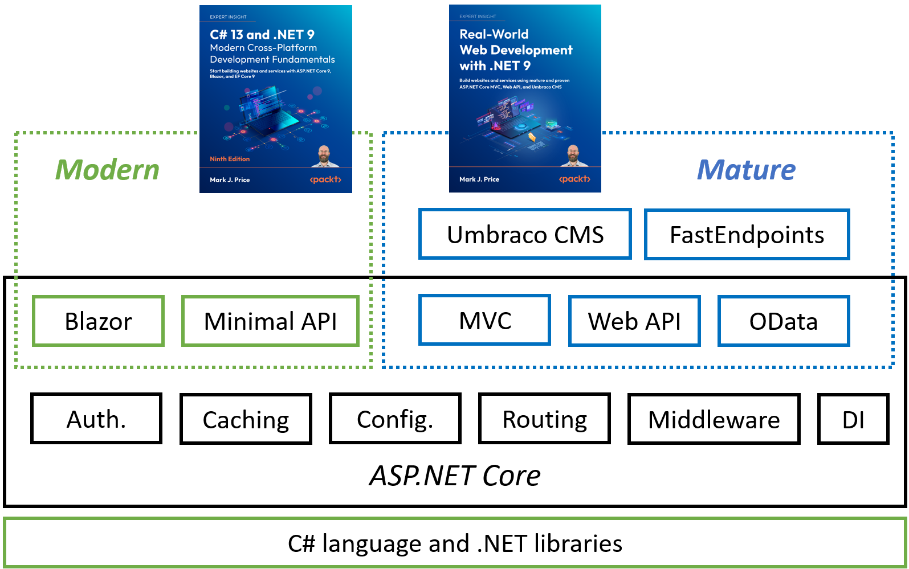
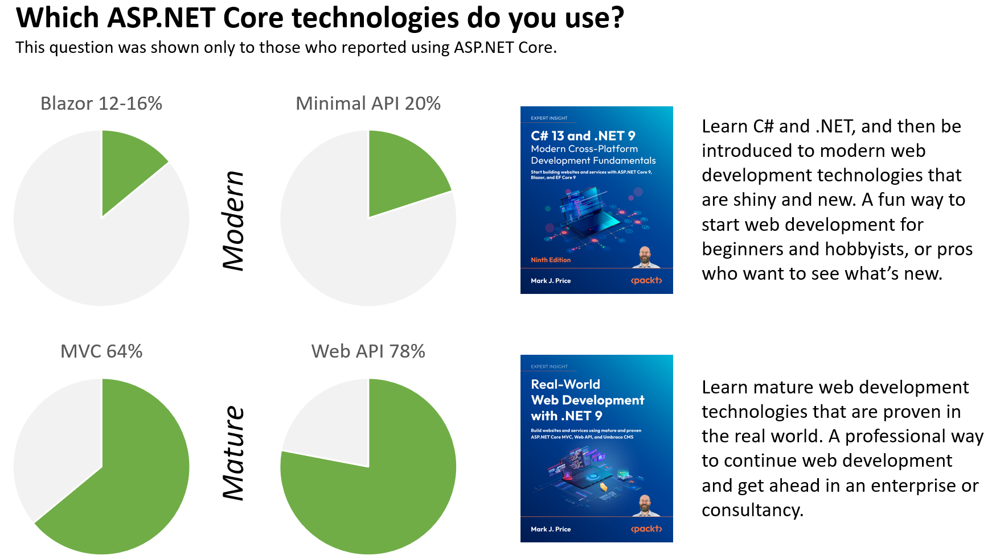
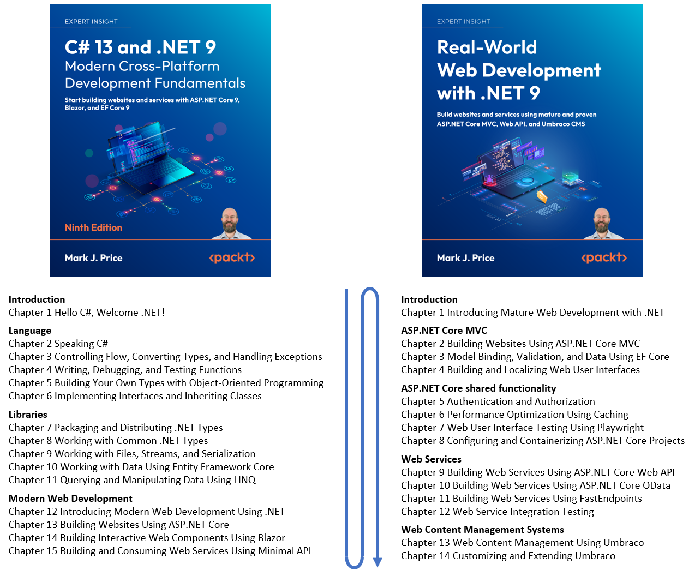

**A pair of .NET 9 books**

- [Introduction](#introduction)
- [What are the modern and mature web technologies in ASP.NET Core?](#what-are-the-modern-and-mature-web-technologies-in-aspnet-core)
  - [Mature](#mature)
  - [Modern](#modern)
  - [Shared](#shared)
- [Why separate modern and mature web technologies?](#why-separate-modern-and-mature-web-technologies)
- [How to read the pair of books](#how-to-read-the-pair-of-books)
- [Thanks to my production team](#thanks-to-my-production-team)
- [Where to buy my books](#where-to-buy-my-books)

# Introduction

In late 2024, in partnership with Packt, I published a pair of .NET 9 books.

- *C# 13 and .NET 9 - Modern Cross-Platform Development Fundamentals* is the ninth edition of my best selling book about the C# language and the .NET platform. Since the first edition in March 2016, this book has been expanded and refined by listening to my readers and working hard to keep up-to-date with the annual .NET releases.

- *Real-World Web Development with .NET 9* continues where my fundamentals book leaves off. Together they are the perfect complement to each other. If you want a broad introduction to .NET 9 that covers both modern web development (using Blazor for the user interface and Minimal API for web services) and mature web development (using MVC for the user interface, then Web API, OData, and FastEndpoints for web services, and Umbraco for content management) then get both! 😁 

# What are the modern and mature web technologies in ASP.NET Core?

.NET includes language compilers like C#, libraries of functionality like collections, file I/O, and data management, as well as a massive framework for web development known as ASP.NET Core. Over the years, these technologies have matured and evolved and have varying strengths and weaknesses. 

ASP.NET technologies can be divided into three categories, mature, modern, and shared, as shown in the following bulleted summaries and in *Figure 1*:

## Mature
- **ASP.NET Core MVC**: for building web user interfaces.
- **ASP.NET Core Web API**: for building web services.
- **ASP.NET Core OData**: for building web services that specialize in flexible data access.
- **FastEndpoints**: for building web services that are extra fast.
- **Umbraco CMS**: for building websites with content that can be managed by non-technical users.

## Modern
- **ASP.NET Core Blazor**: for building web user interfaces.
- **ASP.NET Core Minimal API**: for building web services.

## Shared
- **Authentication and authorization**: for securing websites and web services.
- **Caching**: in-memory and distributed object caching, output caching, and response caching for improving performance and scalability of a website or web service.
- **Configuration**, **Routing**, **Middleware**, and **Dependency Injection (DI)**: for managing components in a website or web service.

These ASP.NET Core technologies (and third-party packages that build on top of it) are shown in *Figure 1*:

*Figure 1: ASP.NET Core technologies in my .NET 9 books*

In *Figure 1*, green boxes show the technologies covered in *C# 13 and .NET 9 - Modern Cross-Platform Development Fundamentals*. Blue boxes show the technologies covered in *Real-World Web Development with .NET 9*. Black boxes show shared components that are covered in both books.

# Why separate modern and mature web technologies?

Surveys of .NET developers show that most people continue to use the mature web technologies that have been in .NET for more than a decade, as shown in *Figure 2*. Publishing a pair of books allows me to cover both modern and mature web development technologies, without forcing readers to learn both if they already know the mature technologies and just want to see the new shiny technologies, or they want to learn the mature technologies used in the real world by professional organizations.

*Figure 2: Which ASP.NET Core technologies do you use?*

In 2023, JetBrains did a survey of 26,348 developers from all around the world and asked about web development technologies and ASP.NET Core usage by .NET developers. The results showed that most .NET developers still use mature and proven controller-based technologies like MVC (64%) and Web API (78%). The modern technologies like Minimal API (20%) and Blazor WebAssembly (12%) were far behind.

# How to read the pair of books

Read the pair of books in this order:

1. Read *C# 13 and .NET 9 - Modern Cross-Platform Development Fundamentals* first to learn the C# language, the .NET libraries, and then be introduced to modern web development with ASP.NET Core, Blazor, and Minimal API web services.
2. Read *Real-World Web Development with .NET 9* second to learn mature web development with ASP.NET Core MVC, Web API, OData, FastEndpoints, and Umbraco CMS, as shown in *Figure 3*: 

*Figure 3: The second book follows on directly from the first book*

# Thanks to my production team

Thanks to the wonderful production teams at my publisher Packt, and especially the awesome Technical Reviewers who caught some of my silly mistakes, both books have 100% five-star ratings in Amazon reviews. They are my highest quality releases ever! 

My personal gratitude to the following amazing people:

- Senior Publishing Product Manager: Suman Sen
- Project Editor: Janice Gonsalves
- Content Development Editors: Shazeen Iqbal, Rebecca Youé, Matt Davies
- Technical Editors: Simanta Rajbangshi, Kushal Sharma, Anirudh Singh
- Developer Relations Marketing Executive: Priyadarshini Sharma
- Technical Reviewers: Kieran Foot, Milan Jovanović, Vishnu VG

# Where to buy my books
All my books are available on Amazon US at the following link: https://www.amazon.com/Mark-J-Price/e/B071DW3QGN/

You can search your preferred bookstore for my books by title.

Learn more about me on my GitHub page: https://github.com/markjprice/
