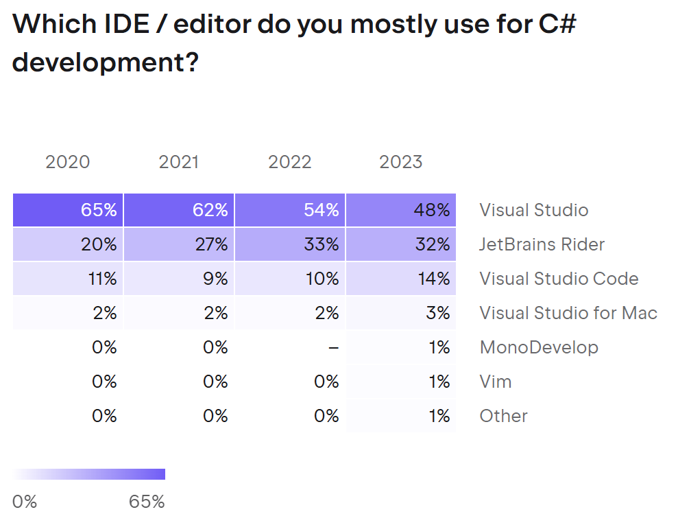

**What do recent surveys about .NET tell us?**

The most recent survey results that inform choices made in my books.

# StackOverflow Survey 2024

"65,437 responses from 185 countries are used in these survey results."

> https://survey.stackoverflow.co/2024/

Half of the surveyed developers use ChatGPT for coding.

---

Those half of developers get plenty of benefits from using AI.

---

Organizations are cautious about allowing AI at work.

---

Not surprising that AWS is on top and the balance of usage has been consistent over the last few years. 

With less than 20% using Azure, I feel that removing coverage of it from my books for the .NET 10 editions is the right call for most of my readers.

---

If the survey was limited to .NET developers, I would then expect the SQL Server usage to be dramatically higher. 

My .NET 10 fundamentals book uses SQLite (and optionally SQL Server) and the other three .NET 10 books use SQL Server. 

I will consider adding coverage for other databases like MySQL and PostgreSQL in future editions.

It makes sense that the more complex the test type, the fewer developers implement those tests. 

I'm impressed that the *None* figure is so low!

# JetBrains’ 2023 survey of C# developers

"We’ve captured insights from 26,348 developers worldwide in our annual Developer Ecosystem Survey 2023."

> https://blog.jetbrains.com/dotnet/2023/11/30/the-developer-ecosystem-in-2023-key-trends-for-csharp/

In 2021, .NET developers stayed with C# 8 (50%) rather than upgrade to C# 9 (30%).

In 2023, they were slower to upgrade to STS editions like C# 11 than to LTS editions like C# 10, but by now they are more comfortable upgrading quickly.

---

In 2023, .NET developers used C# 11 (42%) more than .NET 7 (38%), and C# 10 less than .NET 6. This is likely because they can install the .NET 11 SDK and get the benefits of C# 11 features but continue to target .NET 10 runtime in their projects.

---

The trend is clear from 2020 to 2023: 
- Visual Studio down 17%
- Rider up 12%
- VS Code up 3%.

But this is a JetBrains survey, so the respondents are much more likely to view JetBrains products favorably. 

Visual Studio is still the favorite. 

---

Mostly stable results with Windows the clear winner.

---

This was the survey result that made me write *Real-World Web Development with .NET 9*.

---

I'm happy with my choice to use xUnit in my books.

# .NET Developers community on LinkedIn

The **.NET Developers** community on LinkedIn was surveyed in May 2025 and they confirm that Visual Studio is still the most used IDE:

