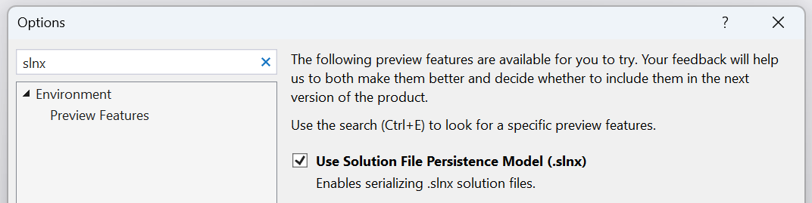
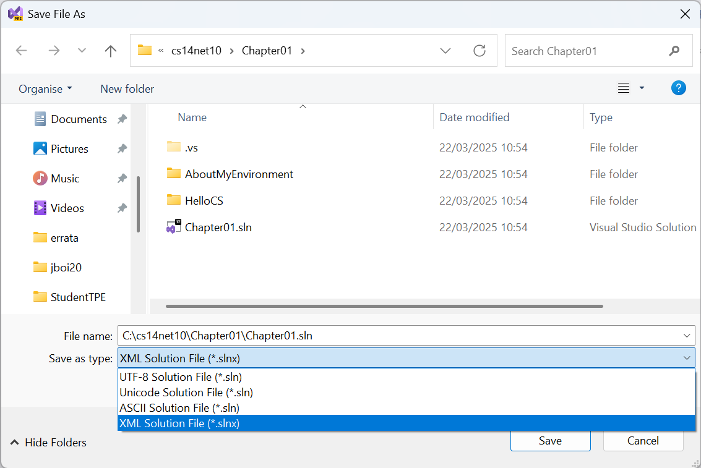

**What's New in your .NET 10 books?**

In the .NET 10 editions of my books I plan to cover the following new features expected in C# 14, .NET 10, ASP.NET Core 10, and EF Core 10.

- [C# 14 and .NET 10 - Modern Cross-Platform Development Fundamentals](#c-14-and-net-10---modern-cross-platform-development-fundamentals)
  - [Chapter 1 - Hello, C#! Welcome, .NET!](#chapter-1---hello-c-welcome-net)
    - [Solution Evolution - `.sln`, `.slnx`, and `.slnf`](#solution-evolution---sln-slnx-and-slnf)
      - [XML Solution Files `.slnx`](#xml-solution-files-slnx)
      - [Visual Studio support for XML Solution Files](#visual-studio-support-for-xml-solution-files)
      - [Other tool support for XML Solution Files](#other-tool-support-for-xml-solution-files)
      - [Solution Filter Files `.slnf`](#solution-filter-files-slnf)
  - [Chapter 2 - Speaking C#](#chapter-2---speaking-c)
    - [Unbound generic support for `nameof`](#unbound-generic-support-for-nameof)
  - [Chapter 3 - Controlling Flow, Converting Types, and Handling Exceptions](#chapter-3---controlling-flow-converting-types-and-handling-exceptions)
    - [Null-conditional assignment](#null-conditional-assignment)
  - [Chapter 5 - Building Your Own Types with Object-Oriented Programming](#chapter-5---building-your-own-types-with-object-oriented-programming)
    - [Partial Members](#partial-members)
    - [Extension Members](#extension-members)
    - [Union Types](#union-types)
  - [Chapter 6 - Implementing Interfaces and Inheriting Classes](#chapter-6---implementing-interfaces-and-inheriting-classes)
    - [User defined compound assignment operators](#user-defined-compound-assignment-operators)
  - [Chapter 7 - Packaging and Distributing .NET Types](#chapter-7---packaging-and-distributing-net-types)
    - [New Noun-First Alias for `dotnet` CLI commmands](#new-noun-first-alias-for-dotnet-cli-commmands)
  - [Chapter 8 - Working with Common .NET Types](#chapter-8---working-with-common-net-types)
    - [Numeric Ordering for String Comparison](#numeric-ordering-for-string-comparison)
    - [Additional `TryAdd` and `TryGetValue` overloads for `OrderedDictionary<TKey, TValue>`](#additional-tryadd-and-trygetvalue-overloads-for-ordereddictionarytkey-tvalue)
  - [Chapter 9 - Working with Files, Streams, and Serialization](#chapter-9---working-with-files-streams-and-serialization)
    - [JSON Patch](#json-patch)
    - [New async Zip APIs](#new-async-zip-apis)
  - [Chapter 11 - Querying and Manipulating Data Using LINQ](#chapter-11---querying-and-manipulating-data-using-linq)
    - [LeftJoin and RightJoin LINQ methods](#leftjoin-and-rightjoin-linq-methods)
  - [Chapter 14 - Building Interactive Web Components Using Blazor](#chapter-14---building-interactive-web-components-using-blazor)
    - [QuickGrid RowClass parameter](#quickgrid-rowclass-parameter)
    - [Add a Not Found page using the Blazor Router](#add-a-not-found-page-using-the-blazor-router)
  - [Chapter 15 - Building and Consuming Web Services](#chapter-15---building-and-consuming-web-services)
    - [OpenAPI 3.1 support](#openapi-31-support)
    - [Generate OpenAPI documents in YAML format](#generate-openapi-documents-in-yaml-format)
    - [Response description on `ProducesResponseType`](#response-description-on-producesresponsetype)
    - [Populate XML doc comments into OpenAPI document](#populate-xml-doc-comments-into-openapi-document)
    - [Detect if URL is local using RedirectHttpResult.IsLocalUrl](#detect-if-url-is-local-using-redirecthttpresultislocalurl)
    - [Validation support in Minimal API web services](#validation-support-in-minimal-api-web-services)
- [Real-World Web Development with .NET 10](#real-world-web-development-with-net-10)
  - [Chapter 9 - Building Web Services Using ASP.NET Core Web API](#chapter-9---building-web-services-using-aspnet-core-web-api)
  - [Chapter 10 - Integration Testing and Building Clients for Web Services](#chapter-10---integration-testing-and-building-clients-for-web-services)
    - [Improvements to integration testing of apps with top-level statements](#improvements-to-integration-testing-of-apps-with-top-level-statements)
    - [Use WebApplicationFactory with Kestrel for integration testing](#use-webapplicationfactory-with-kestrel-for-integration-testing)
- [Apps and Services with .NET 10](#apps-and-services-with-net-10)
  - [Chapter 2 - Building Mobile Apps Using .NET MAUI](#chapter-2---building-mobile-apps-using-net-maui)
  - [Chapter 3 - Building Desktop Apps Using Avalonia](#chapter-3---building-desktop-apps-using-avalonia)
  - [Chapter 10 - Building and Securing Minimal API Web Services](#chapter-10---building-and-securing-minimal-api-web-services)
- [Tools and Skills for .NET 10](#tools-and-skills-for-net-10)


# C# 14 and .NET 10 - Modern Cross-Platform Development Fundamentals

## Chapter 1 - Hello, C#! Welcome, .NET!

### Solution Evolution - `.sln`, `.slnx`, and `.slnf`

Visual Studio allows multiple projects to be grouped and opened together using a solution file `.sln`. The format of this file is a custom plain text file. In *Chapter 1*, the reader creates a solution file that references two projects. If the reader opens the solution file, it would look like the following:
```
Microsoft Visual Studio Solution File, Format Version 12.00
# Visual Studio Version 17
VisualStudioVersion = 17.14.35906.104
MinimumVisualStudioVersion = 10.0.40219.1
Project("{FAE04EC0-301F-11D3-BF4B-00C04F79EFBC}") = "HelloCS", "HelloCS\HelloCS.csproj", "{3C6C0D9B-6823-1380-8FCF-FBF0821511A6}"
EndProject
Project("{FAE04EC0-301F-11D3-BF4B-00C04F79EFBC}") = "AboutMyEnvironment", "AboutMyEnvironment\AboutMyEnvironment.csproj", "{3F7A8DB0-B156-11EA-3DD5-F4C79E02563B}"
EndProject
Global
	GlobalSection(SolutionConfigurationPlatforms) = preSolution
		Debug|Any CPU = Debug|Any CPU
		Release|Any CPU = Release|Any CPU
	EndGlobalSection
	GlobalSection(ProjectConfigurationPlatforms) = postSolution
		{3C6C0D9B-6823-1380-8FCF-FBF0821511A6}.Debug|Any CPU.ActiveCfg = Debug|Any CPU
		{3C6C0D9B-6823-1380-8FCF-FBF0821511A6}.Debug|Any CPU.Build.0 = Debug|Any CPU
		{3C6C0D9B-6823-1380-8FCF-FBF0821511A6}.Release|Any CPU.ActiveCfg = Release|Any CPU
		{3C6C0D9B-6823-1380-8FCF-FBF0821511A6}.Release|Any CPU.Build.0 = Release|Any CPU
		{3F7A8DB0-B156-11EA-3DD5-F4C79E02563B}.Debug|Any CPU.ActiveCfg = Debug|Any CPU
		{3F7A8DB0-B156-11EA-3DD5-F4C79E02563B}.Debug|Any CPU.Build.0 = Debug|Any CPU
		{3F7A8DB0-B156-11EA-3DD5-F4C79E02563B}.Release|Any CPU.ActiveCfg = Release|Any CPU
		{3F7A8DB0-B156-11EA-3DD5-F4C79E02563B}.Release|Any CPU.Build.0 = Release|Any CPU
	EndGlobalSection
	GlobalSection(SolutionProperties) = preSolution
		HideSolutionNode = FALSE
	EndGlobalSection
	GlobalSection(ExtensibilityGlobals) = postSolution
		SolutionGuid = {81C51CB3-C3BC-4812-84B4-E0C19A2B9EA5}
	EndGlobalSection
EndGlobal
```

This is complex and almost impossible to edit manually due to the GUIDs. 

#### XML Solution Files `.slnx`

A replacement syntax is currently in preview, uses XML, and has the `.slnx` file extension. The preceding file would look like the following markup:
```xml
<Solution>
  <Project Path="AboutMyEnvironment/AboutMyEnvironment.csproj" />
  <Project Path="HelloCS/HelloCS.csproj" />
</Solution>
```

This is much easier to work with!

> **More Information**: Learn more at the following link: https://devblogs.microsoft.com/visualstudio/new-simpler-solution-file-format/.

#### Visual Studio support for XML Solution Files

To use the new XML solution format in Visual Studio, enable the feature in **Options**, as shown in the following screenshot:



Then open an existing `.sln` solution file and save it as the new XML format, as shown in the following screenshot:



#### Other tool support for XML Solution Files

The team is working on providing support for the `.slnx` format across various tools and environments. Currently, the following tools support the `.slnx` format:
- MSBuild
- `dotnet` CLI
- C# Dev Kit for VS Code
- JetBrains Rider

> **Warning!** Although you can have both solution file formats in the same directory, it is recommended to only use one or the other to avoid confusing the build tools and other humans.

> **Note**: This new **XML Solution File** format is still in preview at the time of writing in March 2025. It is likely to officially leave preview and reach general availability status in May 2025 or November 2025.

#### Solution Filter Files `.slnf`

To improve performance when opening large solutions, Visual Studio 2019 introduced solution filtering. Solution filtering lets you open a solution with only selective projects loaded. Loading a subset of projects in a solution decreases solution load, build, and test run time, and enables more focused review.

> **Note**: Although solution filtering is not a new feature, I have not covered it in previous editions of my books. I plan to cover it in all my .NET 10 editions, in more depth in the *Fundamentals* book, and briefly in the other books with a reference to an online article about it for more details. 

Solution filter files are JSON files with the extension `.slnf` that indicate which projects to build or load from all the projects in a solution. Starting with MSBuild 16.7, you can invoke MSBuild on the solution filter file to build the solution with filtering enabled.

> **Warning!** The solution filter file reduces the set of projects that will be loaded or built and simplifies the format. The solution file is still required.

For example, in *Chapter 3*, the reader creates six projects during the tasks in that chapter, and optionally four exercises at the end of the chapter. The solution file references all ten projects. I also include two solution filters, one for tasks and one for exercises. 

[`Chapter03-Tasks.slnf`](https://github.com/markjprice/cs14net10/blob/main/code/Chapter03/Chapter03-Tasks.slnf) looks like the following JSON:
```json
{
  "solution": {
    "path": "Chapter03.sln",
    "projects": [
      "Arrays\\Arrays.csproj",
      "CastingConverting\\CastingConverting.csproj",
      "HandlingExceptions\\HandlingExceptions.csproj",
      "IterationStatements\\IterationStatements.csproj",
      "Operators\\Operators.csproj",
      "SelectionStatements\\SelectionStatements.csproj"
    ]
  }
}
```

[`Chapter03-Exercises.slnf`](https://github.com/markjprice/cs14net10/blob/main/code/Chapter03/Chapter03-Exercises.slnf) looks like the following JSON:
```json
{
  "solution": {
    "path": "Chapter03.sln",
    "projects": [
      "Exercise_Exceptions\\Exercise_Exceptions.csproj",
      "Exercise_FizzBuzz\\Exercise_FizzBuzz.csproj",
      "Exercise_LoopsAndOverflow\\Exercise_LoopsAndOverflow.csproj",
      "Exercise_Operators\\Exercise_Operators.csproj"
    ]
  }
}
```

> **Warning!** Solution filter files are tied to a specific solution file. If you migrate your solution from `.sln` to `.slnx` then you’ll need to update the filter file to reference the new `.slnx` file, otherwise it will still try to open the old `.sln` file.

Learn more about solution filters at the following links:
- [Filtered solutions in Visual Studio](https://learn.microsoft.com/en-us/visualstudio/ide/filtered-solutions)
- [Solution filters in MSBuild](https://learn.microsoft.com/en-us/visualstudio/msbuild/solution-filters)
- [JetBrains Rider - Work with solution filters](https://www.jetbrains.com/help/rider/Solution_filters.html)

## Chapter 2 - Speaking C#

### Unbound generic support for `nameof`

The argument to a `nameof` expression can be an unbound generic type, like `List<>`. The result of the expression is `"List"`. Previously, you'd need to supply a type argument for each type parameter.

## Chapter 3 - Controlling Flow, Converting Types, and Handling Exceptions

### Null-conditional assignment

After the *Assignment operator* and *Null-coalescing operators* sections, I will add a new section for *Null-conditional assignment*.

Null-conditional assignment assigns a value to a property or field only if the containing instance exists. Imagine you have a code similar to:
```cs
public class Customer
{
  public string Name { get; set; }
  public int Age { get; set; }
}

public class UpdateCustomer
{
  public static void UpdateAge(Customer? customer, int newAge)
  {
    if (customer is not null)
    {
      customer.Age = newAge;
    }
  }
}
```

You can simplify the UpdateAge method:
```cs
public static void UpdateAge(Customer? customer, int newAge)
{
  customer?.Age = newAge;
}
```

If the customer is not null, `Age` will be updated. If customer is null, nothing will happen.

> **More Information**: https://github.com/dotnet/csharplang/discussions/8676

## Chapter 5 - Building Your Own Types with Object-Oriented Programming

### Partial Members

Over the past 20 years, C# has added features that allow partial types and members. The `partial` keyword can decorate a type like `class`, `struct`, or `interface` to split its implementation between multiple files. This feature was most commonly used by code-generating user interface designers in Visual Studio and other code editors. More recently, source generators use this feature to achieve similar goals.

The `partial` keyword can decorate the following members:
- Methods
- Properties
- Indexers
- Events
- Instance Constructors

But with C# 14 and earlier the `partial` keyword *cannot* decorate the following members:
- Static Constructors
- Finalizers
- Overloaded Operators
- Delegates
- Enums

A summary of what C# version and the year that these `partial` features where added to the language is shown in *Table 1*:

Feature|Version|Year
---|---|---
Partial Types|C# 2|2005
Partial Methods|C# 3|2007
Partial Properties|C# 13|2024
Partial Events, Instance Constructors, `field` keyword|C# 14|2025

*Table 1: `partial` feature, version, and year*

> **Note**: The `field` keyword was a preview feature in C# 13. You must target .NET 9 and set the `<LangVersion>` element to `preview` in your project file in order to use the `field` contextual keyword. In C# 14 and later, the `field` keyword is available as standard. Learn more at the following link: https://learn.microsoft.com/en-us/dotnet/csharp/language-reference/keywords/field.

> **Warning!** Partial properties, indexers, and events can't use auto-implemented syntax for the implementing declaration because the defining declaration uses the same syntax.

Learn more from the Microsoft Learn documentation:
- [Partial member (C# Reference)](https://learn.microsoft.com/en-us/dotnet/csharp/language-reference/keywords/partial-member)
- [Partial Classes and Members (C# Programming Guide)](https://learn.microsoft.com/en-us/dotnet/csharp/programming-guide/classes-and-structs/partial-classes-and-methods)

*C# Language Specification*: The language specification is the definitive source for C# syntax and usage.
- [15.2.7 Partial type declarations](https://learn.microsoft.com/en-us/dotnet/csharp/language-reference/language-specification/classes#1527-partial-type-declarations)
- [15.6.9 Partial methods](https://learn.microsoft.com/en-us/dotnet/csharp/language-reference/language-specification/classes#1569-partial-methods)
- [Partial properties](https://learn.microsoft.com/en-us/dotnet/csharp/language-reference/proposals/csharp-13.0/partial-properties)
- [Partial Events and Constructors](https://learn.microsoft.com/en-us/dotnet/csharp/language-reference/proposals/partial-events-and-constructors)

### Extension Members

*Extension methods* were introduced in C# 3 in 2007. In C# 14, you can also define other types of *extension member*: static methods, instance properties, and static properties. 

*Extension members* expand the concept of extension methods to allow more kinds of “adding stuff” onto existing types you don’t control. You can now define extension blocks, using a new `extension(...) { ... }` syntax, that group together a set of extension members targeting a receiver type. Inside those blocks you can define instance and static extension methods and properties. I think extension members are among the more useful incremental improvements in recent C#. 

Expanding extensions to other member types has been a long-standing challenge, driven by two key questions: how to declare them effectively and how to resolve ambiguity when multiple matching signatures exist. Additionally, we aimed to seamlessly support the new syntax for instance members—ensuring that users of instance extension methods never have to worry about whether they were declared with the old or new syntax. 

Extension methods in C# 3 and later require a `static` class with a `static` method with a parameter decorated with `this` to indicate what type the extension method will apply to, as shown in the following code:
```cs
public static class Extensions
{
  public static IEnumerable<int> WhereGreaterThan(this IEnumerable<int> source, int threshold) 
    => source.Where(x => x > threshold);
}
```

The **receiver** is the parameter prefaced by the `this` keyword - `source` in the preceding code example. Property declarations do not have a similar location to declare the receiver. Thus, C# 14 introduces **extension blocks**. These are blocks with a scope that exposes the receiver to its contained members. If we switch the `WhereGreaterThan` extension method to the new syntax and add an `IsEmpty` property the extension block would be:
```cs
public static class Extensions
{
  extension(IEnumerable<int> source) 
  {
    public IEnumerable<int> WhereGreaterThan(int threshold)
      => source.Where(x => x > threshold);

    public bool IsEmpty
      => !source.Any();
  }
}
```

To use these extension members, you just call them:
```cs
List<int> list = [ 1, 2, 3, 4, 5 ];

IEnumerable<int> large = list.WhereGreaterThan(3);

if (large.IsEmpty)
{
  Console.WriteLine("No large numbers.");
}
else
{
  Console.WriteLine("Found large numbers.");
}
```

Generics are supported and the resolution rules are the same as for extension methods. Extension blocks can seamlessly coexist with the extension methods you have today. There's no requirement to switch to the new syntax - both execute in exactly the same way. Just add extension blocks to the static classes that contain your existing extension methods. The choice is entirely yours. If you prefer to leave your existing extension methods untouched, you absolutely can. But if you’d rather update your code for a consistent look and take advantage of the new syntax, that option is available too. 

> **More Information**: https://github.com/dotnet/csharplang/discussions/8696 and https://devblogs.microsoft.com/dotnet/csharp-exploring-extension-members/

### Union Types

> **Note**: Union Types will not be officially supported in C# 14 and .NET 10, but they might be available in preview, and they are likely to be supported in future versions, so I plan to add an online-only section about them and related third-party libraries that provide similar features today.

## Chapter 6 - Implementing Interfaces and Inheriting Classes

### User defined compound assignment operators

This feature enables type authors to implement compound assignment operators in a manner that modifies the target in place rather than create copies.

For example, the `+=` operator was defined to perform the addition and then an assignment. In other words, the code:
```cs
a += b;
```
Was the same as the following code:
```cs
a = a + b;
```
If the type of `a` was a class, a typical implementation of operator `+` creates a new instance of that type. The compound assignment operator impacts memory usage. The original instance of a becomes garbage and a newly allocated instance takes its place. For larger types, this causes unnecessary memory churn. That churn, in turn, causes increased memory pressure and creates more work for the garbage collector.

As more programs use `Tensor` types or other large data structures, this cost becomes more significant

Library authors can now create user defined implementations for any of the compound assignment operators: +=, -=, *=, /=, %=, &=, |=, ^=, <<=, >>= and >>>=. In addition, the +=, -=, *= and /= operators can include both `checked` and `unchecked` variants.

## Chapter 7 - Packaging and Distributing .NET Types

### New Noun-First Alias for `dotnet` CLI commmands 

Starting in .NET 10, the `dotnet` CLI tool has new aliases for commonly-used commands. The new aliases are:
- `dotnet package add`
- `dotnet package list`
- `dotnet package remove`
- `dotnet reference add`
- `dotnet reference list`
- `dotnet reference remove`

These commands exist in the current versions of the dotnet CLI, but only in verb-first forms. For example, `dotnet add package`, `dotnet list package`, `dotnet remove package`, and so on. 

Noun-first forms have become a general standard for CLI applications, so this change will make the `dotnet` CLI more consistent with other CLI tools. The verb-first forms will continue to work in .NET 10, but Microsoft recommends that you use the noun-first forms to make your scripts and documentation more readable and easier to understand. In the .NET 10 editions of all my books I will switch to the noun-first forms.

> The `dotnet add project` command is first introduced in *Chapter 4* when referencing a class library project in the *Creating a class library that needs testing* section. The `dotnet add package` command is first introduced at the end of *Chapter 4* in an optional online section about logging, [Adding packages to a project in VS Code](https://github.com/markjprice/cs13net9/blob/main/docs/ch04-logging.md#adding-packages-to-a-project-in-vs-code). I will switch to using the noun-first forms in those tasks.

## Chapter 8 - Working with Common .NET Types

### Numeric Ordering for String Comparison

Numerical string comparison is a highly requested feature for comparing strings numerically instead of lexicographically. For example, `2` is less than `10`, so `"2"` should appear before `"10"` when ordered numerically. Similarly, `"2"` and `"02"` are equal numerically. With the new `CompareOptions.NumericOrdering` option, it is now possible to do these types of comparisons, as shown in the following code:
```cs
StringComparer numericStringComparer = StringComparer.Create(CultureInfo.CurrentCulture, CompareOptions.NumericOrdering);

Console.WriteLine(numericStringComparer.Equals("02", "2"));
// Output: True

foreach (string os in new[] { "Windows 10", "Windows 8", "Windows 11" }.Order(numericStringComparer))
{
  Console.WriteLine(os);
}

// Output:
// Windows 8
// Windows 10
// Windows 11

HashSet<string> set = new(numericStringComparer) { "007" };
Console.WriteLine(set.Contains("7"));
// Output: True
```

### Additional `TryAdd` and `TryGetValue` overloads for `OrderedDictionary<TKey, TValue>`

`OrderedDictionary<TKey, TValue>` provides `TryAdd` and `TryGetValue` for addition and retrieval. There are scenarios where you might want to perform additional operations, so new overloads have been added which return an index to the entry, as shown in the following code:
```cs
public class OrderedDictionary<TKey, TValue>
{
  // New overloads
  public bool TryAdd(TKey key, TValue value, out int index);
  public bool TryGetValue(TKey key, out TValue value, out int index);
}
```
This index can then be used with `GetAt`/`SetAt` for fast access to the entry. An example usage of the new `TryAdd` overload is to add or update a key/value pair in the ordered dictionary, as shown in the following code:
```cs
public static void IncrementValue(OrderedDictionary<string, int> orderedDictionary, string key)
{
  // Try to add a new key with value 1.
  if (!orderedDictionary.TryAdd(key, 1, out int index))
  {
    // Key was present, so increment the existing value instead.
    int value = orderedDictionary.GetAt(index).Value;
    orderedDictionary.SetAt(index, value + 1);
  }
}
```

This new API is now being used in `JsonObject` to improve the performance of updating properties by 10-20%.

## Chapter 9 - Working with Files, Streams, and Serialization

### JSON Patch

JSON Patch is a standard format for describing changes to apply to a JSON document, defined in RFC 6902. It represents a sequence of operations (e.g., add, remove, replace, move, copy, test) that can be applied to modify a JSON document. In web applications, JSON Patch is commonly used in a PATCH operation to perform partial updates of a resource. Instead of sending the entire resource for an update, clients can send a JSON Patch document containing only the changes. This reduces payload size and improves efficiency.

https://github.com/dotnet/core/blob/main/release-notes/10.0/preview/preview4/aspnetcore.md#json-patch-with-systemtextjson

### New async Zip APIs

.NET 10 introduces new asynchronous APIs for working with ZIP archives, making it easier to perform non-blocking operations when reading from or writing to ZIP files. The new APIs, added to the System.IO.Compression and System.IO.Compression.ZipFile assemblies, provide async methods for extracting, creating, and updating ZIP archives. These methods enable developers to efficiently handle large files and improve application responsiveness, especially in scenarios involving I/O-bound operations.

```cs
// Extract a Zip archive
await ZipFile.ExtractToDirectoryAsync("archive.zip", "destinationFolder", overwriteFiles: true);

// Create a Zip archive
await ZipFile.CreateFromDirectoryAsync("sourceFolder", "archive.zip", CompressionLevel.SmallestSize, includeBaseDirectory: true, entryNameEncoding: Encoding.UTF8);

// Open an archive
await using ZipArchive archive = ZipFile.OpenReadAsync("archive.zip");

// Fine-grained manipulation
using FileStream archiveStream = File.OpenRead("archive.zip");

await using (ZipArchive archive = await ZipArchive.CreateAsync(archiveStream, ZipArchiveMode.Update, leaveOpen: false, entryNameEncoding: Encoding.UTF8))
{
  foreach (ZipArchiveEntry entry in archive.Entries)
  {
    // Extract an entry to the filesystem
    await entry.ExtractToFileAsync(destinationFileName: "file.txt", overwrite: true);

    // Open an entry's stream
    await using Stream entryStream = await entry.OpenAsync();

    // Create an entry from a filesystem object
    ZipArchiveEntry createdEntry = await archive.CreateEntryFromFileAsync(sourceFileName "path/to/file.txt", entryName: "file.txt");
  }
}
```

https://github.com/dotnet/core/blob/main/release-notes/10.0/preview/preview4/libraries.md#new-async-zip-apis

## Chapter 11 - Querying and Manipulating Data Using LINQ

### LeftJoin and RightJoin LINQ methods

`LEFT JOIN` is a common and useful operation when working with EF Core. In previous versions, implementing `LEFT JOIN` in LINQ was quite complicated, requiring `SelectMany`, `GroupJoin` and `DefaultIfEmpty` operations in a particular configuration, as shown in the following code:
```cs
var query = students
    .GroupJoin(
        departments,
        student => student.DepartmentID,
        department => department.ID,
        (student, departmentList) => new { student, subgroup = departmentList })
    .SelectMany(
        joinedSet => joinedSet.subgroup.DefaultIfEmpty(),
        (student, department) => new
        {
            student.student.FirstName,
            student.student.LastName,
            Department = department.Name ?? "[NONE]"
        });
```

.NET 10 adds first-class LINQ support for `LeftJoin` method, making those queries much simpler to write. EF Core recognizes the new method, so it can be used in EF LINQ queries instead of the old construct:
```cs
var query = students
    .LeftJoin(
        departments,
        student => student.DepartmentID,
        department => department.ID,
        (student, department) => new 
        { 
            student.FirstName,
            student.LastName,
            Department = department.Name ?? "[NONE]"
        });
```

.NET 10 Preview 2 added support for the `RightJoin` operator which keeps all the data from the second collection and only the matching data from the first collection. EF Core 10 translates this to `RIGHT JOIN` operation in the database.

> **More Information**: Support the new .NET 10 `LeftJoin` operators: https://github.com/dotnet/efcore/issues/12793.

## Chapter 14 - Building Interactive Web Components Using Blazor

### QuickGrid RowClass parameter

Apply a stylesheet class to a row of the grid based on the row item using the new `RowClass` parameter. In the following example, the `ApplyRowStyle` method is called on each row to conditionally apply a stylesheet class based on the row item:
```xml
<QuickGrid ... RowClass="ApplyRowStyle">
    ...
</QuickGrid>
```
```cs
@code {
    private string ApplyRowStyle({TYPE} rowItem) =>
        rowItem.{PROPERTY} == {VALUE} ? "{CSS STYLE CLASS}" : null;
}
```

### Add a Not Found page using the Blazor Router

Blazor now provides an improved way to display a "Not Found" page when navigating to a non-existent page. You can specify a page to render when `NavigationManager.NotFound()` is called by passing a page type to the `Router` component using the `NotFoundPage` parameter. This approach is recommended over the previous `NotFound` fragment, as it supports routing, works across code re-execution middleware, and is compatible even with non-Blazor scenarios. 
```html
<Router AppAssembly="@typeof(Program).Assembly" NotFoundPage="typeof(Pages.NotFound)">
  <Found Context="routeData">
    <RouteView RouteData="@routeData" />
    <FocusOnNavigate RouteData="@routeData" Selector="h1" />
  </Found>
  <NotFound>This content will be ignored because we have NotFoundPage defined.</NotFound>
</Router>
```
The Blazor project template now includes a `NotFound.razor` page by default. This page will automatically render whenever `NavigationManager.NotFound()` is called in your application, making it easier to handle missing routes with a consistent user experience.

## Chapter 15 - Building and Consuming Web Services

### OpenAPI 3.1 support

ASP.NET Core has added support for generating OpenAPI version 3.1 documents in .NET 10. The default OpenAPI version for generated documents will be 3.1, but you can change this by setting the `OpenApiVersion` property of the `OpenApiOptions` in the delegate parameter of `AddOpenApi`, as shown in the following code:
```cs
builder.Services.AddOpenApi(options =>
{
    // Specify the OpenAPI version to use.
    options.OpenApiVersion = Microsoft.OpenApi.OpenApiSpecVersion.OpenApi3_0;
});
```

### Generate OpenAPI documents in YAML format

ASP.NET now supports serving the generated OpenAPI document in YAML format. YAML can be more concise than JSON, eliminating curly braces and quotation marks when these can be inferred. YAML also supports multi-line strings, which can be useful for long descriptions.

To configure your application to serve the generated OpenAPI document in YAML format, specify the endpoint in the MapOpenApi call with a ".yaml" or ".yml" suffix, as shown in the following code:
```cs
app.MapOpenApi("/openapi/{documentName}.yaml");
```

### Response description on `ProducesResponseType`

`ProducesAttribute`, `ProducesResponseTypeAttribute`, and `ProducesDefaultResponseType` now accept an optional `string` parameter, `Description`, that will set the description of the response in the generated OpenAPI document.
```cs
[HttpGet(Name = "GetWeatherForecast")]
[ProducesResponseType<IEnumerable<WeatherForecast>>(StatusCodes.Status200OK, Description = "The weather forecast for the next 5 days.")]
public IEnumerable<WeatherForecast> Get()
{
  ...
}
```
Generated OpenAPI response:
```json
"responses": {
  "200": {
    "description": "The weather forecast for the next 5 days.",
    "content": { ... }
  }
}
```

### Populate XML doc comments into OpenAPI document

ASP.NET Core OpenAPI document generation will now include metadata from XML doc comments on method, class, and member definitions in the OpenAPI document. You must enable XML doc comments in your project file to use this feature. You can do this by adding the following property to your project file:
```xml
<PropertyGroup>
  <GenerateDocumentationFile>true</GenerateDocumentationFile>
</PropertyGroup>
```

At build-time, the OpenAPI package will leverage a source generator to discover XML comments in the current app assembly and any project references and emit source code to insert them into the document via an OpenAPI document transformer.

Note that the C# build process doesn't capture XML doc comments placed on lambda expressions; so to use XML doc comments to add metadata to a minimal API endpoint, you must define the endpoint handler as a method, put the XML doc comments on the method, and then reference that method from the MapXXX method.

For example, to use XML doc comments to add metadata to this minimal API endpoint originally defined as a lambda expression:
```cs
app.MapGet("/hello", (string name) =>$"Hello, {name}!");
```

Change the `MapGet` call to reference a method like `Hello`:
```cs
app.MapGet("/hello", Hello);
```

Then define the `Hello` method with XML doc comments in any accessible class in your project. For example, it could be added to the `Program` class, as shown in the following code:
```cs
static partial class Program
{
  /// <summary>
  /// Sends a greeting.
  /// </summary>
  /// <remarks>
  /// Greeting a person by their name.
  /// </remarks>
  /// <param name="name">The name of the person to greet.</param>
  /// <returns>A greeting.</returns>
  public static string Hello(string name)
  {
    return $"Hello, {name}!";
  }
}
```

### Detect if URL is local using RedirectHttpResult.IsLocalUrl

Use the new `RedirectHttpResult.IsLocalUrl(url)` helper method to detect if a URL is local. A URL is considered local if it does not have the host or authority part and it has an absolute path. This method is useful for validating URLs before redirecting to them to prevent open redirection attacks, as shown in the following code:
```cs
if (RedirectHttpResult.IsLocalUrl(url))
{
  return Results.LocalRedirect(url);
}
```

### Validation support in Minimal API web services

Support for validation in minimal APIs is now available. This feature allows you to request validation of data sent to your API endpoints. When validation is enabled, the ASP.NET Core runtime performs any validations defined on query, header, and route parameters, as well as on the request body. Validations can be defined using attributes in the `System.ComponentModel.DataAnnotations` namespace. When validation fails, the runtime returns a `400 Bad Request` response with details of the validation errors.

To enable built-in validation support for Minimal APIs, call the `AddValidation` extension method to register the required services into the service container for your application, as shown in the following code:
```cs
builder.Services.AddValidation();
```

You also need to set the `InterceptorsNamespaces` property in your project file as follows:
```xml
<PropertyGroup>
  <!-- Enable the generation of interceptors for the validation attributes -->
  <InterceptorsNamespaces>$(InterceptorsNamespaces);Microsoft.AspNetCore.Http.Validation.Generated</InterceptorsNamespaces>
</PropertyGroup>
```

The implementation automatically discovers types that are defined in Minimal API handlers or as base types of types defined in Minimal API handlers. Validation is performed on these types by an endpoint filter added to each endpoint.

Validation can be disabled for specific endpoints by using the `DisableValidation` extension method.
```cs
app.MapPost("/products",
  ([EvenNumber(ErrorMessage = "Product ID must be even")] int productId, [Required] string name)
    => TypedResults.Ok(productId))
  .DisableValidation();
```

Preview 4 added support for record type parameters.

# Real-World Web Development with .NET 10

I will be slightly rebalancing chapters in this edition:

1. Introducing Real-World Web Development with .NET
2. Building Websites Using ASP.NET Core MVC
3. Model Binding, Validation, and Data Using EF Core
4. Building and Localizing Web User Interfaces
5. Authentication and Authorization
6. Performance Optimization Using Caching
7. Web User Interface Testing Using Playwright
8. Configuring and Containerizing ASP.NET Core Projects
9. Building Web Services Using ASP.NET Core Web API
10. Integration Testing and Building Clients for Web Services
11. Building Web Services Using ASP.NET Core OData
12. Building Web Services Using FastEndpoints
13. Web Content Management Using Umbraco CMS
14. Customizing and Extending Umbraco CMS

## Chapter 9 - Building Web Services Using ASP.NET Core Web API

Most of the improvements to OpenAPI documentation in [Chapter 15 - Building and Consuming Web Services](#chapter-15---building-and-consuming-web-services) apply to controller-based Web API services too.

Some more advanced features include: Generate OpenAPI schemas in transformers: https://github.com/dotnet/core/blob/main/release-notes/10.0/preview/preview4/aspnetcore.md#generate-openapi-schemas-in-transformers

## Chapter 10 - Integration Testing and Building Clients for Web Services

### Improvements to integration testing of apps with top-level statements

.NET 10 now has better support for testing apps that use top-level statements. In the 1st edition, I had to manually add `public partial class Program` to the `Program.cs` file so that the test project could reference the `Program` class. This is because the top-level statement feature generates a `Program` class that is declared as `internal`.

Explicitly declaring the `Program` class to be `public` to use it in an integration test project:
https://github.com/markjprice/web-dev-net9/blob/main/code/MatureWeb/Northwind.WebApi/Program.cs#L8

In .NET 10, a source generator is used to generate the `public partial class Program` declaration if the developer did not declare it explicitly. In addition, an analyzer was added to detect when `public partial class Program` is declared explicitly and advise the developer to remove it.

In the .NET 10 edition, I will explain this improvement so readers who need to continue to use older versions of .NET will still be able to write integration tests.

### Use WebApplicationFactory with Kestrel for integration testing

You can now use `WebApplicationFactory` with Kestrel for integration testing instead of the in-memory TestServer. This allows you to run integration tests against a real Kestrel server, including automated browser testing. To use Kestrel with `WebApplicationFactory`, first call `UseKestrel` and then `StartServer()` to start the server. Use overloads of `UseKestrel` to optionally configure the port or other Kestrel options.

The following example shows testing an web app using `WebApplicationFactory`, Kestrel, xUnit.net, and Playwright:
```cs
public class BlazorWebAppFactory : WebApplicationFactory<Program>
{
  protected override void ConfigureWebHost(IWebHostBuilder builder)
  {
    builder.ConfigureTestServices(svc =>
    {
        svc.AddTransient<IWeatherService, TestWeatherService>();
    });
  }
}

public class WeatherPageTests : PageTest
{
  [Fact]
  public async Task Page_LoadsSuccessfully()
  {
    using var waf = new BlazorWebAppFactory();

    waf.UseKestrel();
    waf.StartServer();

    await Task.Delay(30000);
    var privacyPagePath = waf.ClientOptions.BaseAddress.ToString() + "weather";
    var response = await Page.GotoAsync(privacyPagePath);
    var content = await response!.TextAsync();

    await Expect(Page).ToHaveTitleAsync("Weather");
    Assert.Contains(TestWeatherService.TestWeatherSummary, content);
  }
}
```

https://github.com/dotnet/core/blob/main/release-notes/10.0/preview/preview4/aspnetcore.md#use-webapplicationfactory-with-kestrel-for-integration-testing

# Apps and Services with .NET 10

I will be slightly reorganizing chapters in this edition. This includes moving the "Apps" chapters to the beginnning of the book, adding Avalonia for desktop apps, and removing all dependencies on Azure cloud features:
1. Introducing Apps and Services with .NET
2. Building Mobile Apps Using .NET MAUI
3. Building Desktop Apps Using Avalonia
4. Building Web Apps Using Blazor
5. Implementing Popular Third-Party Libraries
6. Handling Dates, Times, and Internationalization
7. Managing Relational Data Using SQL
8. Building Entity Models Using EF Core
9. Building a Custom LLM-based Service
10. Building and Securing Minimal API Web Services
11. Caching, Queuing, and Resilient Background Services
12. Broadcasting Real-Time Communication Using SignalR
13. Combining Data Sources Using GraphQL Services
14. Building Efficient Microservices Using gRPC

## Chapter 2 - Building Mobile Apps Using .NET MAUI

The Android and iOS implementations of `MediaPicker` for taking and picking photos have been updated to use the latest platform APIs when available thus providing the latest user experience.
https://github.com/dotnet/core/blob/main/release-notes/10.0/preview/preview4/dotnetmaui.md#mediapicker-modernization

Added nullable support to `DatePicker` for `Date`, `MinimumDate`, and `MaximumDate` properties, and to `TimerPicker` for the `Time` property.
https://github.com/dotnet/core/blob/main/release-notes/10.0/preview/preview4/dotnetmaui.md#nullable-pickers

## Chapter 3 - Building Desktop Apps Using Avalonia

This is a whole new chapter. I decided to cover Avalonia because Microsoft is shrinking the team that maintains MAUI. 

## Chapter 10 - Building and Securing Minimal API Web Services

All of the improvements to OpenAPI documentation in [Chapter 15 - Building and Consuming Web Services](#chapter-15---building-and-consuming-web-services) apply to controller-based Web API services too.


# Tools and Skills for .NET 10

This second edition only needs a minimal update, mostly for the rapid improvements to .NET Aspire.
1. Introducing Tools and Skills for .NET
2. Making the Most of the Tools in your Code Editor
3. Source Code Management Using Git
4. Debugging and Memory Troubleshooting
5. Logging, Tracing, and Metrics for Observability
6. Documenting Code, APIs, and Services
7. Observing and Modifying Code Execution Dynamically
8. Protecting Data and Apps Using Cryptography
9. Multitasking and Concurrency
10. Dependency Injection, Containers, and Service Lifetime
11. Unit Testing and Mocking
12. Integration and Security Testing
13. Benchmarking Performance, Load, and Stress Testing
14. Functional and End-to-End Testing of Websites and Services
15. Containerization Using Docker
16. Cloud-Native Development Using .NET Aspire
17. Design Patterns and Principles
18. Software and Solution Architecture Foundations
19. Your Career, Teamwork, and Interviews

The **Multitasking and Concurrency** chapter has moved to this book from *Apps and Services with .NET 10*.
The **Building a Custom LLM-based Service** has moved from this book to *Apps and Services with .NET 10*.
