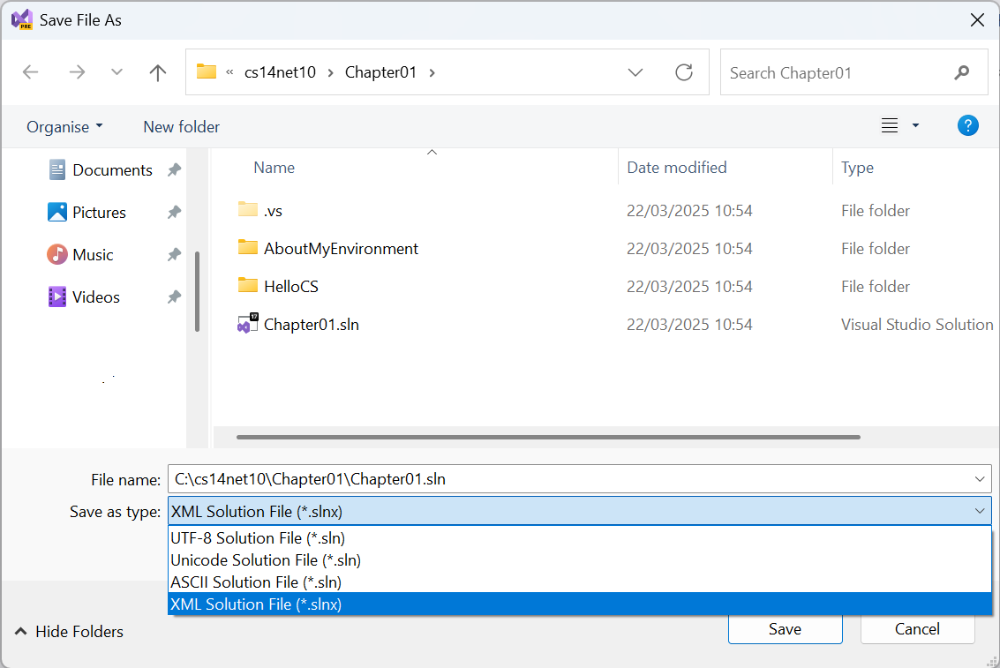

**What's New in your .NET 10 books?**

The .NET 10 editions of my quartet of .NET books cover the following new features in C# 14 and .NET 10.

- [C# 14 and .NET 10 - Modern Cross-Platform Development Fundamentals](#c-14-and-net-10---modern-cross-platform-development-fundamentals)
  - [Chapter 1 - Hello, C#! Welcome, .NET!](#chapter-1---hello-c-welcome-net)
    - [Solution Evolution - `.sln`, `.slnx`, and `.slnf`](#solution-evolution---sln-slnx-and-slnf)
      - [XML Solution Files `.slnx`](#xml-solution-files-slnx)
      - [Solution Filter Files `.slnf`](#solution-filter-files-slnf)
  - [Chapter 5 - Building Your Own Types with Object-Oriented Programming](#chapter-5---building-your-own-types-with-object-oriented-programming)
    - [Union Types](#union-types)
    - [Partial Members](#partial-members)
  - [Chapter 7 - Packaging and Distributing .NET Types](#chapter-7---packaging-and-distributing-net-types)
    - [New Noun-First Alias for `dotnet` CLI commmands](#new-noun-first-alias-for-dotnet-cli-commmands)
  - [Chapter 11 - Querying and Manipulating Data Using LINQ](#chapter-11---querying-and-manipulating-data-using-linq)
    - [LeftJoin and RightJoin LINQ methods](#leftjoin-and-rightjoin-linq-methods)
  - [Chapter 15 - Building and Consuming Web Services](#chapter-15---building-and-consuming-web-services)
    - [Populate XML doc comments into OpenAPI document](#populate-xml-doc-comments-into-openapi-document)
- [Real-World Web Development with .NET 10](#real-world-web-development-with-net-10)
- [Apps and Services with .NET 10](#apps-and-services-with-net-10)
- [Tools and Skills for .NET 10](#tools-and-skills-for-net-10)


# C# 14 and .NET 10 - Modern Cross-Platform Development Fundamentals

## Chapter 1 - Hello, C#! Welcome, .NET!

### Solution Evolution - `.sln`, `.slnx`, and `.slnf`

Visual Studio allows multiple projects to be grouped and opened together using a solution file `.sln`. The format of this file is a custom plain text file. In *Chapter 1*, the reader creates a solution file that references two projects. If the reader opens the solution file, it would look like the following:
```yaml
Microsoft Visual Studio Solution File, Format Version 12.00
# Visual Studio Version 17
VisualStudioVersion = 17.14.35906.104
MinimumVisualStudioVersion = 10.0.40219.1
Project("{FAE04EC0-301F-11D3-BF4B-00C04F79EFBC}") = "HelloCS", "HelloCS\HelloCS.csproj", "{3C6C0D9B-6823-1380-8FCF-FBF0821511A6}"
EndProject
Project("{FAE04EC0-301F-11D3-BF4B-00C04F79EFBC}") = "AboutMyEnvironment", "AboutMyEnvironment\AboutMyEnvironment.csproj", "{3F7A8DB0-B156-11EA-3DD5-F4C79E02563B}"
EndProject
Global
	GlobalSection(SolutionConfigurationPlatforms) = preSolution
		Debug|Any CPU = Debug|Any CPU
		Release|Any CPU = Release|Any CPU
	EndGlobalSection
	GlobalSection(ProjectConfigurationPlatforms) = postSolution
		{3C6C0D9B-6823-1380-8FCF-FBF0821511A6}.Debug|Any CPU.ActiveCfg = Debug|Any CPU
		{3C6C0D9B-6823-1380-8FCF-FBF0821511A6}.Debug|Any CPU.Build.0 = Debug|Any CPU
		{3C6C0D9B-6823-1380-8FCF-FBF0821511A6}.Release|Any CPU.ActiveCfg = Release|Any CPU
		{3C6C0D9B-6823-1380-8FCF-FBF0821511A6}.Release|Any CPU.Build.0 = Release|Any CPU
		{3F7A8DB0-B156-11EA-3DD5-F4C79E02563B}.Debug|Any CPU.ActiveCfg = Debug|Any CPU
		{3F7A8DB0-B156-11EA-3DD5-F4C79E02563B}.Debug|Any CPU.Build.0 = Debug|Any CPU
		{3F7A8DB0-B156-11EA-3DD5-F4C79E02563B}.Release|Any CPU.ActiveCfg = Release|Any CPU
		{3F7A8DB0-B156-11EA-3DD5-F4C79E02563B}.Release|Any CPU.Build.0 = Release|Any CPU
	EndGlobalSection
	GlobalSection(SolutionProperties) = preSolution
		HideSolutionNode = FALSE
	EndGlobalSection
	GlobalSection(ExtensibilityGlobals) = postSolution
		SolutionGuid = {81C51CB3-C3BC-4812-84B4-E0C19A2B9EA5}
	EndGlobalSection
EndGlobal
```

This is complex and almost impossible to edit manually due to the GUIDs. 

#### XML Solution Files `.slnx`

A replacement syntax is currently in preview, uses XML, and has the `.slnx` file extension. The preceding file would look like the following markup:
```xml
<Solution>
  <Project Path="AboutMyEnvironment/AboutMyEnvironment.csproj" />
  <Project Path="HelloCS/HelloCS.csproj" />
</Solution>
```

To use the new format in Visual Studio, enable the feature in **Options**, as shown in the following screenshot:


Then open a solution and save it as the new format, as shown in the following screenshot:


> **Warning!** Although you can have both solution file formats in the same directory, it is recommended to only use one or the other to avoid cofusing the build tools and other humans.

> **Note**: This new **XML Solution File** format is still in preview at the time of writing in March 2025. Most code editors now support it, including Visual Studio, VS Code, and Rider. I think it is likely to officially leave preview and reach general availability status in May 2025 or November 2025.

#### Solution Filter Files `.slnf`

To improve performance when opening large solutions, Visual Studio 2019 introduced solution filtering. Solution filtering lets you open a solution with only selective projects loaded. Loading a subset of projects in a solution decreases solution load, build, and test run time, and enables more focused review.

> **Note**: Although solution filtering is not a new feature, I have note covered it in previous editions of my books. I plan to cover it in all my .NET 10 editions. 

Solution filter files are JSON files with the extension `.slnf` that indicate which projects to build or load from all the projects in a solution. Starting with MSBuild 16.7, you can invoke MSBuild on the solution filter file to build the solution with filtering enabled.

> **Warning!** The solution filter file reduces the set of projects that will be loaded or built and simplifies the format. The solution file is still required.

For example, in *Chapter 3*, the reader creates six projects during the tasks in that chapter, and optionally four exercises at the end of the chapter. The solution file references all ten projects. I also include two solution filters, one for tasks and one for exercises. 

`Chapter03-Tasks.slnf` looks like the following JSON:
```json
{
  "solution": {
    "path": "Chapter03.sln",
    "projects": [
      "Arrays\\Arrays.csproj",
      "CastingConverting\\CastingConverting.csproj",
      "HandlingExceptions\\HandlingExceptions.csproj",
      "IterationStatements\\IterationStatements.csproj",
      "Operators\\Operators.csproj",
      "SelectionStatements\\SelectionStatements.csproj"
    ]
  }
}```

`Chapter03-Exercises.slnf` looks like the following JSON:
```json
{
  "solution": {
    "path": "Chapter03.sln",
    "projects": [
      "Exercise_Exceptions\\Exercise_Exceptions.csproj",
      "Exercise_FizzBuzz\\Exercise_FizzBuzz.csproj",
      "Exercise_LoopsAndOverflow\\Exercise_LoopsAndOverflow.csproj",
      "Exercise_Operators\\Exercise_Operators.csproj"
    ]
  }
}
```

Learn more about solution filters at the following links:
- [Filtered solutions in Visual Studio](https://learn.microsoft.com/en-us/visualstudio/ide/filtered-solutions)
- [Solution filters in MSBuild](https://learn.microsoft.com/en-us/visualstudio/msbuild/solution-filters)
- [JetBrains Rider - Work with solution filters](https://www.jetbrains.com/help/rider/Solution_filters.html)

## Chapter 5 - Building Your Own Types with Object-Oriented Programming

### Union Types


### Partial Members

Over the past 20 years, C# has added features that allow partial types and members. The `partial` keyword can decorate a type like `class`, `struct`, or `interface` to split its implementation between multiple files. This feature was most commonly used by code-generating user interface designers in Visual Studio and other code editors. More recently, source generators use this feature to achieve similar goals.

The `partial` keyword can decorate the following members:
- Methods
- Properties
- Indexers
- Events
- Instance constructors

But with C# 14 and earlier the `partial` keyword *cannot* decorate the following members:
- Static constructors
- Finalizers
- Overloaded operators
- Delegates
- Enums

Feature|Version|Year
---|---|---
Partial Types|C# 2|2005
Partial Methods|C# 3|2007
Partial Properties|C# 13|2024
Partial Events, Instance Contructors, `field` keyword|C# 14|2025

> **Note**: The `field` keyword was a preview feature in C# 13. You must target .NET 9 and set the `<LangVersion>` element to `preview` in your project file in order to use the `field` contextual keyword. In C# 14 and later, the `field` keyword is available as standard.

> **Warning!** Partial properties, indexers, and events can't use auto-implemented syntax for the implementing declaration because the defining declaration uses the same syntax.

Learn more from the Microsoft Learn documentation:
- [Partial member (C# Reference)](https://learn.microsoft.com/en-us/dotnet/csharp/language-reference/keywords/partial-member)
- [Partial Classes and Members (C# Programming Guide)](https://learn.microsoft.com/en-us/dotnet/csharp/programming-guide/classes-and-structs/partial-classes-and-methods)

*C# Language Specification*: The language specification is the definitive source for C# syntax and usage.
- [15.2.7 Partial type declarations](https://learn.microsoft.com/en-us/dotnet/csharp/language-reference/language-specification/classes#1527-partial-type-declarations)
- [15.6.9 Partial methods](https://learn.microsoft.com/en-us/dotnet/csharp/language-reference/language-specification/classes#1569-partial-methods)
- [Partial properties](https://learn.microsoft.com/en-us/dotnet/csharp/language-reference/proposals/csharp-13.0/partial-properties)
- [Partial Events and Constructors](https://learn.microsoft.com/en-us/dotnet/csharp/language-reference/proposals/partial-events-and-constructors)

## Chapter 7 - Packaging and Distributing .NET Types

### New Noun-First Alias for `dotnet` CLI commmands 

Starting in .NET 10, the `dotnet` CLI tool has new aliases for commonly-used commands. The new aliases are:
- `dotnet package add`
- `dotnet package list`
- `dotnet package remove`
- `dotnet reference add`
- `dotnet reference list`
- `dotnet reference remove`

These commands exist in the current versions of the dotnet CLI, but only in verb-first forms. For example, `dotnet add package`, `dotnet list package`, `dotnet remove package`, and so on. 

Noun-first forms have become a general standard for CLI applications, so this change will make the `dotnet` CLI more consistent with other CLI tools. The verb-first forms will continue to work in .NET 10, but Microsoft recommends that you use the noun-first forms to make your scripts and documentation more readable and easier to understand. In the .NET 10 editions of all my books I will switch to the noun-first forms.

> The `dotnet add project` command is first introduced in *Chapter 4* when referencing a class library project in the *Creating a class library that needs testing* section. The `dotnet add package` command is first introduced at the end of *Chapter 4* in an optional online section about logging, [Adding packages to a project in VS Code](https://github.com/markjprice/cs13net9/blob/main/docs/ch04-logging.md#adding-packages-to-a-project-in-vs-code). I will switch to using the noun-first forms in those tasks.

## Chapter 11 - Querying and Manipulating Data Using LINQ

### LeftJoin and RightJoin LINQ methods

`LEFT JOIN` is a common and useful operation when working with EF Core. In previous versions, implementing `LEFT JOIN` in LINQ was quite complicated, requiring `SelectMany`, `GroupJoin` and `DefaultIfEmpty` operations in a particular configuration, as shown in the following code:
```cs
var query = students
    .GroupJoin(
        departments,
        student => student.DepartmentID,
        department => department.ID,
        (student, departmentList) => new { student, subgroup = departmentList })
    .SelectMany(
        joinedSet => joinedSet.subgroup.DefaultIfEmpty(),
        (student, department) => new
        {
            student.student.FirstName,
            student.student.LastName,
            Department = department.Name ?? "[NONE]"
        });
```

.NET 10 adds first-class LINQ support for `LeftJoin` method, making those queries much simpler to write. EF Core recognizes the new method, so it can be used in EF LINQ queries instead of the old construct:
```cs
var query = students
    .LeftJoin(
        departments,
        student => student.DepartmentID,
        department => department.ID,
        (student, department) => new 
        { 
            student.FirstName,
            student.LastName,
            Department = department.Name ?? "[NONE]"
        });
```

.NET 10 Preview 2 added support for the `RightJoin` operator which keeps all the data from the second collection and only the matching data from the first collection. EF Core 10 translates this to `RIGHT JOIN` operation in the database.

> **More Information**: Support the new .NET 10 LeftJoin operators: https://github.com/dotnet/efcore/issues/12793.

## Chapter 15 - Building and Consuming Web Services

### Populate XML doc comments into OpenAPI document

ASP.NET Core OpenAPI document generation will now include metadata from XML doc comments on method, class, and member definitions in the OpenAPI document. You must enable XML doc comments in your project file to use this feature. You can do this by adding the following property to your project file:
```xml
<PropertyGroup>
  <GenerateDocumentationFile>true</GenerateDocumentationFile>
</PropertyGroup>
```

At build-time, the OpenAPI package will leverage a source generator to discover XML comments in the current app assembly and any project references and emit source code to insert them into the document via an OpenAPI document transformer.

Note that the C# build process doesn't capture XML doc comments placed on lambda expressions; so to use XML doc comments to add metadata to a minimal API endpoint, you must define the endpoint handler as a method, put the XML doc comments on the method, and then reference that method from the MapXXX method.

For example, to use XML doc comments to add metadata to this minimal API endpoint originally defined as a lambda expression:
```cs
app.MapGet("/hello", (string name) =>$"Hello, {name}!");
```

Change the `MapGet` call to reference a method like `Hello`:
```cs
app.MapGet("/hello", Hello);
```

Then define the `Hello` method with XML doc comments in any accessible class in your project. For example, it could be added to the `Program` class, as shown in the following code:
```cs
static partial class Program
{
    /// <summary>
    /// Sends a greeting.
    /// </summary>
    /// <remarks>
    /// Greeting a person by their name.
    /// </remarks>
    /// <param name="name">The name of the person to greet.</param>
    /// <returns>A greeting.</returns>
    public static string Hello(string name)
    {
        return $"Hello, {name}!";
    }
}
```

# Real-World Web Development with .NET 10


# Apps and Services with .NET 10


# Tools and Skills for .NET 10

