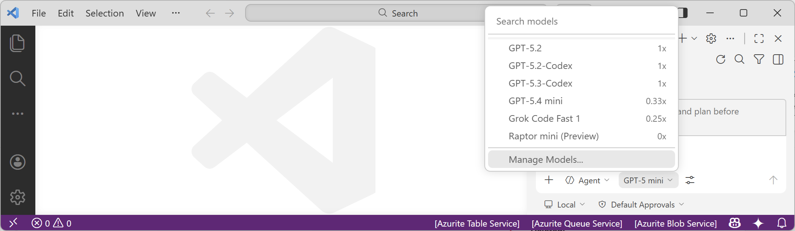
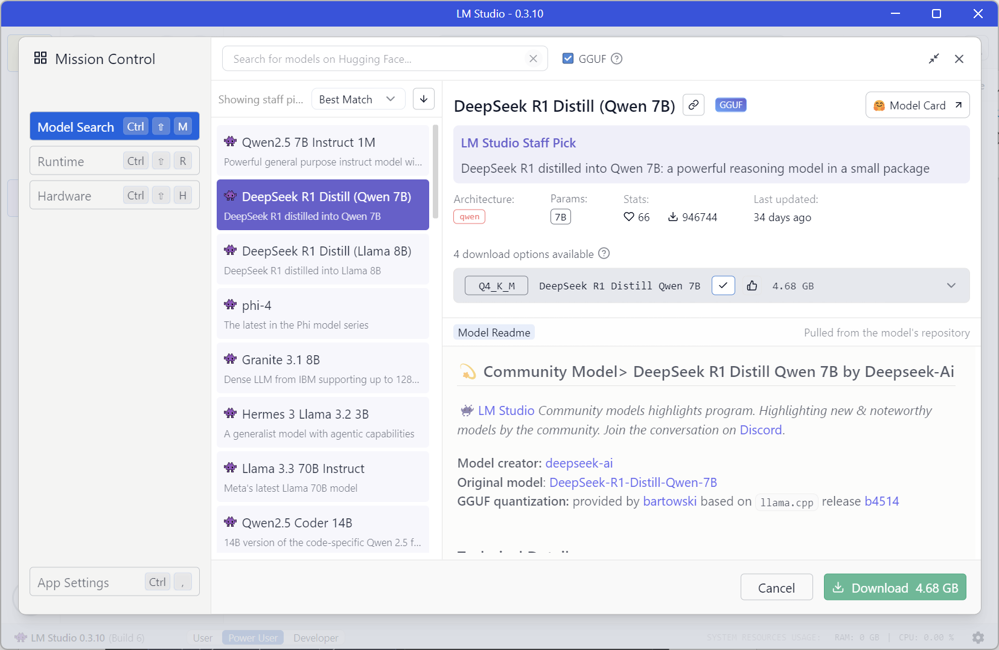
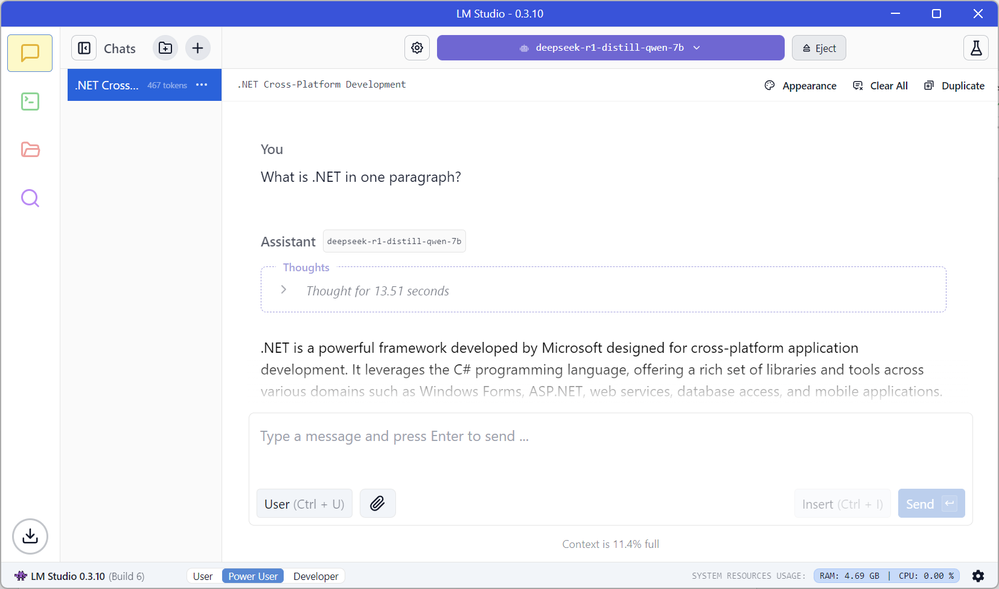
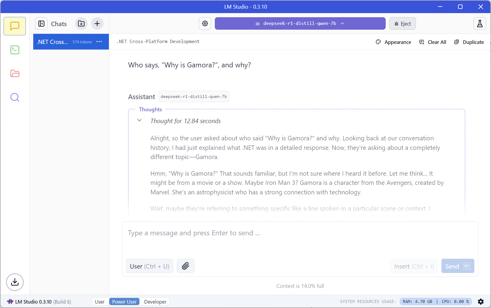

**Configuring a "free" local LLM**

- [Configuring a "free" local LLM](#configuring-a-free-local-llm)
- [What is Ollama?](#what-is-ollama)
- [Models, size, and capabilities](#models-size-and-capabilities)
- [What is quantization?](#what-is-quantization)
- [Downloading and running Ollama models](#downloading-and-running-ollama-models)
- [Ollama CLI](#ollama-cli)
- [Integrating Ollama with VS Code](#integrating-ollama-with-vs-code)
- [Running local models with LM Studio](#running-local-models-with-lm-studio)
- [Setting expectations for the local versus cloud](#setting-expectations-for-the-local-versus-cloud)
  - [$2,000 range (high-end consumer desktop or laptop)](#2000-range-high-end-consumer-desktop-or-laptop)
  - [$5,000 range (serious workstation)](#5000-range-serious-workstation)
  - [$10,000-$20,000 range (enthusiast and semi-professional multi-GPU)](#10000-20000-range-enthusiast-and-semi-professional-multi-gpu)
  - [$50,000 range (small lab or startup setup)](#50000-range-small-lab-or-startup-setup)
- [Local model cost summary](#local-model-cost-summary)
- [Interesting Reddit posts about local models](#interesting-reddit-posts-about-local-models)
  - [MacBook Pro M1 Max 64GB unified memory](#macbook-pro-m1-max-64gb-unified-memory)
  - [Pros and cons of local and cloud models](#pros-and-cons-of-local-and-cloud-models)
  - [Cons of using the cloud](#cons-of-using-the-cloud)
  - [Gemma 4 31B and cons of local (more management)](#gemma-4-31b-and-cons-of-local-more-management)


# Configuring a "free" local LLM

This path is for readers who want to avoid API costs and keep prompts and responses local. In practice, you still sign into GitHub to use Copilot in VS Code, but you can run the model inference locally through Ollama for supported chat experiences. 

# What is Ollama?

Ollama is a software tool designed for managing LLMs on local devices. This tool allows users to run sophisticated language models, such as LLaMA (Large Language Model Meta AI), on their own machines rather than relying solely on cloud-based solutions.
By running models locally, Ollama ensures that sensitive data remains on the user's device, enhancing privacy and security compared to cloud-based services. Users maintain full ownership and control over their data, which is particularly important for sensitive or proprietary information.

Developers and researchers can use Ollama to experiment with and fine-tune LLMs without the need for cloud resources. Running models locally can be more cost-effective in the long run, as it eliminates the need for continuous cloud service subscriptions. However, local installations require ongoing maintenance and updates, which can be more complex compared to managed cloud services.

To run LLMs locally, users need powerful hardware, typically including high-end CPUs, significant RAM, and often graphics processing units (GPUs) to handle the intensive computation. Running models locally reduces latency, which is critical for applications requiring immediate responses. LLMs are resource-intensive, and not all users may have the necessary hardware to run them efficiently.

Ollama aims to simplify the installation and setup process, providing tools and documentation to help users get started with minimal friction.

# Models, size, and capabilities

Models often come in multiple variations, typically by size and capability. For example:
- The `mistral:instruct` model follows instructions.
- The `mistral:text` model is the base foundation model without any fine-tuning for conversations and is best used for simple text completion.
- `llama` and `llama:70b` vary by size.

Smaller models like llama can perform adequately for less complex tasks like basic text generation, simple question answering, and summarization. For applications requiring real-time responses like chatbots, smaller models are generally better due to lower inference latency. 

More complex tasks such as nuanced understanding, detailed reasoning, and generating longer, coherent text may benefit from larger models like llama:70b. But larger models require significantly more computational power and memory for both training and inference. Also consider that sometimes a smaller, fine-tuned model can outperform a larger, general-purpose model in specific domains.

When you see names like 7B, 8B, or 70B next to a language model, the B stands for billion parameters. A parameter is simply a number inside the neural network that helps determine how it responds to input. You can think of parameters as adjustable dials the model learned during training.

A 7B model has about 7 billion parameters. A 70B model has ten times as many.

In general:
- More parameters gives better reasoning, nuance, and long-form coherence
- Fewer parameters gives faster responses and lower hardware requirements

However, larger models require dramatically more memory (RAM or GPU VRAM) to run. A 70B model can require tens of gigabytes of memory, while a 7B model can run on a modern laptop with enough RAM.

> **Prompt**: What hardware specs are realistically required to run a 7B model smoothly? Explain quantization in local LLMs and how it affects performance and quality.

# What is quantization?

Quantization is a way of compressing a model so it uses less memory and runs faster. By default, model weights are stored as high-precision numbers (often 16-bit or 32-bit floating-point values). Quantization reduces the precision of those numbers, for example: 16-bit → 8-bit, or 8-bit → 4-bit. This makes the model much smaller in memory.

Think of it like saving an image:
- A RAW image file is large and very precise.
- A JPEG is smaller but slightly less accurate.
- A heavily compressed JPEG is much smaller but may lose visible detail.

Quantized models are like compressed JPEGs of neural networks. They are smaller and faster, but may lose some subtle reasoning ability. If you are running a model locally with Ollama or LM Studio:
- A full-precision 7B model might require 14–16 GB of memory.
- A 4-bit quantized 7B model might fit in 4–6 GB.

This is often the difference between won’t run on your laptop and runs comfortably. Most local LLM setups use quantized versions by default because they are far more practical for everyday development work. For typical developer tasks like generating boilerplate, writing unit tests, explaining code, and refactoring small functions, a 7B or 8B quantized model is often more than sufficient.

For deep architectural reasoning, long multi-file analysis, and subtle debugging, larger cloud-hosted models still have an advantage. To run larger models locally requires a lot of costly hardware, like an NVIDIA DGX Spark, multi-GPU desktop or rack, or a Mac Studio with hundreds of gigabytes of unified memory. 

> **Prompt**: Please compare llama3.1 8B versus 70B for coding tasks. What practical differences would I see?

# Downloading and running Ollama models

To quickly download and run an Ollama model in interactive mode, use the following command:
```shell
ollama run <model>
```

The most common models supported by Ollama include those shown in *Table 11.2*:

Model|Parameters|Size
---|---|---
deepseek-r1|7 B|4.7 GB
llama3.3|70 B|40 GB
llama3.2|3 B|2.0 GB
llama3.1|8 B|4.9 GB
codellama|7 B|3.8 GB
llama2-uncensored|7 B|3.8 GB
phi3|3.8 B|2.3 GB
mistral|7 B|4.1 GB
gemma:7b|7 B|4.8 GB
gemma:2b|2 B|1.4 GB

*Table 11.2: Common Ollama models*

*Uncensored* in the context of LLMs means the model operates without predefined restrictions on the content it can generate, allowing for a broader range of output but also increasing the risks associated with harmful or inappropriate content. This characteristic makes uncensored models potentially valuable for research and development, or to help a standup comic write jokes, but it also requires careful consideration of the ethical and practical implications of using such a model in real-world applications.

We will use Meta’s Llama 3.1 model for its versatility and to maximize the likelihood that it will run okay on your computer. You can read the license agreement at the following link: https://www.llama.com/llama3/license/.

# Ollama CLI

The Ollama CLI provides a range of commands to manage and run LLMs locally. While the exact commands and options may vary depending on the version of Ollama and its implementation, the following is a general overview of common CLI commands and their typical usage.

Let's explore what you can do with the Ollama CLI with the Llama 3 model:
1.	At the command prompt or terminal, enter the command to check its version, as shown in the following command:
```shell
ollama --version
```
2.	Note the response, as shown in the following output:
```
ollama version is 0.13.5
```
3.	At the command prompt or terminal, enter the command to pull down a named model like Meta’s Llama3 or Google’s Gemma3, as shown in the following command:
```shell
ollama pull gemma3:1b
```
> You can see the Llama3 models at the following link: https://ollama.com/library/llama3. You can see all the Gemma3 models at the following link: https://ollama.com/library/gemma3.

4.	Note the response, as shown in the following output:
```
pulling manifest
pulling 6a0746a1ec1a... 100% ▕████████████████████████████████████████████████████████▏ 4.7 GB
pulling 4fa551d4f938... 100% ▕████████████████████████████████████████████████████████▏  12 KB
pulling 8ab4849b038c... 100% ▕████████████████████████████████████████████████████████▏  254 B
pulling 577073ffcc6c... 100% ▕████████████████████████████████████████████████████████▏  110 B
pulling 3f8eb4da87fa... 100% ▕████████████████████████████████████████████████████████▏  485 B
verifying sha256 digest
writing manifest
success
```
> You can remove a model using the following command: `ollama rm gemma3:1b`.

5.	At the command prompt or terminal, enter the command to list the available local models, as shown in the following command:
```shell
ollama list
```
6.	Note the response, as shown in the following output:
```
NAME              ID              SIZE    MODIFIED
gemma3:1b         8648f39daa8f    815 MB  7 seconds ago
llama3.1:latest   46e0c10c039e    4.9 GB  2 minutes ago
```
7.	At the command prompt or terminal, enter the command to run a named model (which will also download it if not already pulled):
```shell
ollama run gemma3:1b
```
8.	Note the response, as shown in the following output:
```
>>> Send a message (/? for help)
```
9.	Enter a prompt, like, `What is Django?`, and note the response, which will use Markdown syntax for formatting.
10.	Enter the command to exit: `/bye`

>Ollama CLI also has commands to copy models and create new models. You can learn about these and other commands in the documentation at the following link: https://github.com/ollama/ollama#cli-reference.

Ollama provides client libraries for Python and JavaScript.

# Integrating Ollama with VS Code

Let’s do it:
1.	Add Ollama as a model provider in VS Code via the AI Toolkit extension, which can add Ollama models and endpoints into VS Code’s model list.

> You can learn more about the AI Toolkit extension at the following link: https://learn.microsoft.com/en-us/windows/ai/toolkit/

2.	A typical UI flow (as documented by Ollama) is in the Copilot sidebar. In the **Pick Model** dropdown, expand **Other Models**, choose **Manage Models**, pick **Ollama** as the provider, and select the local model you pulled, as shown in *Figure 1*:

 

*Figure 1: Selecting a model for GitHub Copilot in VS Code*

3.	In Copilot Chat, switch the model to your Ollama-backed model.
4.	Test with a safe task first: `Explain what this function does` or `Generate unit tests for this method signature`.

> **Prompt**: What are the security risks of running uncensored models locally?

# Running local models with LM Studio

An alternative to Ollama is **LM Studio**, with which you can:
- Run LLMs on your laptop, entirely offline
- Use models through the in-app Chat UI or an OpenAI-compatible local server
- Download any compatible model files from Hugging Face repositories
- Discover new and noteworthy LLMs on the app's home page

To get started with LM Studio:
1.	In your preferred browser, navigate to: https://lmstudio.ai/.
2.	Click the button to download LM Studio for your OS.
3.	Once it’s downloaded, start the desktop app.
4.	Navigate to the model search page and pick a suitable model. Click the model’s **Download** button, as shown in *Figure 2:*

  

*Figure 2: The LM Studio model download page for DeepSeek’s R1 7B model*

5.	Wait for the model to download.
6.	Navigate to Chats, and at the top of the window, select the model you downloaded.
7.	In the USER box, enter a prompt, for example: What is Django in one paragraph?. Note the response, which should be reasonably accurate, as shown in *Figure 3*:



*Figure 3: LM Studio chat session*

8.	In the **USER** box, enter a prompt, for example: `Who says, "Why is Gamora?", and why`?
9.	Note that the response may include hallucinations, as shown in the following response:
```
The phrase "Why is Gamora?" doesn’t appear to be widely recognized as an actual quote or line spoken by the character Gamora in any media, including Marvel's Iron Man or other related works. If you encountered this phrasing elsewhere, it might be a misremembered reference to something specific from a particular source or context (like a fan fiction, movie reference, or joke). Could you provide more context? I’d be happy to help further!
```

10.	With advanced models like DeepSeek’s R1, it can be useful to expand the **Thinking…** section, as shown in the following output and in *Figure 11.5*:
```
Thought for 12.84 seconds

Alright, so the user asked about who said "Why is Gamora?" and why. Looking back at our conversation history, I had just explained what .NET was in a detailed response. Now, they're asking about a completely different topic—Gamora.

Hmm, "Why is Gamora?" That sounds familiar, but I'm not sure where I heard it before. Let me think... It might be from a movie or a show. Maybe Iron Man 3? Gamora is a character from the Avengers, created by Marvel. She's an astrophysicist who has a strong connection with technology.

Wait, maybe they're referring to something specific like a line spoken in a particular scene or context. I should check if that phrase exists anywhere. If it's not widely known, perhaps it's from fan fiction or a lesser-known source.

Also, considering the user might be confused between different characters or misremembering something. Maybe they saw the character Gamora and associated her with a specific quote without knowing its origin.

I should make sure to explain that "Why is Gamora?" isn't a widely recognized line and suggest it's possible they're thinking of a particular source. Offering further help could be useful if they need more information or clarification.
```



*Figure 4: What was the model thinking?*

11.	Now, if I ask the same question to ChatGPT-5.5, I get a much better response:
```
The line "Why is Gamora?" is said by Drax, a character from the movie Avengers: Infinity War. This moment occurs during a scene where the Avengers confront the Guardians of the Galaxy for the first time. 
[cont.]
```

Cloud-based AI coding assistants tend to be more capable overall because they run on larger, frequently updated models with access to broader training data and higher compute, which usually translates into better code generation, deeper reasoning, and faster improvements over time. 

Local models, by contrast, offer stronger privacy, lower latency, and full control over the environment, but they are typically smaller and less accurate unless you have access to high-end hardware and invest time in tuning them. In practice, cloud models are generally more effective for complex or unfamiliar tasks, while local models are better suited to sensitive codebases or situations where offline access and data control matter more than peak performance.

# Setting expectations for the local versus cloud

Local models are great for routine refactors, test scaffolding, and explain this codebase tasks. They will likely always be weaker at deep reasoning than the state of the art (SOTA) cloud models and be about 6-12 months behind in capabilities even if you spend tens of thousands of dollars on local hardware. 

Top cloud models (SOTA):
- Equivalent to ~100B–1T+ parameter systems (mixture-of-experts)
- Trained on massive proprietary datasets
- Run on multi-GPU clusters with huge memory bandwidth

What that means in practice:
- Strong reasoning across long contexts
- Reliable multi-file code generation
- Better debugging and architectural decisions
- Fewer hallucinations (still not zero)

Local setups do not match this today. Let’s compare some real-world examples of hardware options for local models.

## $2,000 range (high-end consumer desktop or laptop)

Typical hardware would be a decent desktop CPU or Apple Silicon (M2/M3), 16–32 GB RAM, and RTX 4060 / 4070 (8–12 GB VRAM) discrete GPU or unified memory on Mac.
With that you can run 7B–13B models (quantized, 4-bit or 8-bit) like LLaMA 3 8B, Mistral 7B, Gemma 7B. This is good for code completion, small function generation, explaining code, basic refactoring, but is weak at multi-file reasoning, complex debugging, long context tasks, performance feel. It would make occasional dumb mistakes and it needs a lot of supervision. Many developers would feel disappointed with the experience.

## $5,000 range (serious workstation)

Typical hardware would be a RTX 4090 (24 GB VRAM) GPU, 64 GB RAM, and a strong CPU.
With that you can run 13B–34B models comfortably or 70B models with quantization (but this is slower). This is good for medium-sized code generation, unit tests, refactors, some architectural reasoning, but it still struggles with deep multi-step reasoning, large codebases, and performance feel is fast for 13B/34B models but 70B models are usable but slower.

## $10,000-$20,000 range (enthusiast and semi-professional multi-GPU)

Typical hardware would be 1–4 × RTX 4090 or workstation GPUs (A6000 class) and 128-256 GB RAM.
With that you can run 70B models are reasonable-to-good speed with better context handling. Some larger models can be used with aggressive quantization. This is good for real development workflows, multi-file understanding, solid refactoring and code generation. But it is still weaker at subtle reasoning, edge-case debugging, and performance feel finally becomes decent. This means that you can rely on it for daily development tasks.

## $50,000 range (small lab or startup setup)

Typical hardware would be 4–8 high-end GPUs (A100 / H100 class or equivalents) with high-bandwidth interconnects and 256 GB+ RAM.
With that you can run 70B+ models at high speed and larger open models (depending on VRAM). Fine-tune training your own custom models becomes realistic. This is very strong at coding tasks, internal tools, domain-specific fine-tuned models, but it is still weaker than cloud at frontier reasoning, general intelligence breadth, and performance feel is fast, powerful, production-capable so it can replace cloud for many internal tasks.
Summary of local model ability to replace cloud models

# Local model cost summary

Even at $50,000 or more you are still not running anything close to GPT-5.5 or Claude Opus 3.7 internally. You are running smaller, distilled, or open-weight models. The gap is not just hardware. It is training data, model architecture, reinforcement tuning, and ongoing updates.

It is dangerously easy to get excited while reading Reddit posts about all the developers who are buying up Mac Studios with M-class Ultras and 512 GB unified memory, or multi-GPU rack-mounted setups in their basements. Yes, it’s cool for experienced developers who already have well-paying employment with excess income to spend on expensive hobbies, but if you’re a beginner at programming, it’s literally a dream, not reality! I don’t want to be a killjoy but temper your expectations.

Despite all that, local setups are better in specific areas:
- **Privacy**: No code leaves your machine. Essential for proprietary or sensitive work
- **Cost (long-term)**: No per-token billing. Heavy usage becomes cheaper over time
- **Latency**: Instant response for small models. No network dependency
- **Control**: You can fine-tune. You can customize behavior

As usual, the best option is to do both, appropriately:
- Use cloud models for hard problems like design and architectural decisions that involve multi-step reasoning, large context, ambiguity, or real-world consequences
- Use local models for speed, privacy, and routine tasks like writing small functions, explaining syntax, generating boilerplate, refactoring a single file, and writing tests

> **Good practice**: If the task requires judgment, not just generation, use a cloud model.

# Interesting Reddit posts about local models

## MacBook Pro M1 Max 64GB unified memory

I currently own a MacBook Pro M1 Max 64GB unified memory. So I was interested to read a recent Reddit post by a local model user with the same machine.

> *Currently run Qwen3.6 and Gemma4-26b (both 8bits) on M1Max 64GB via oMLX. This setup is enough for me to write scripts for data analytic tasks (what I use Sonnet 4.6 for). Low key the quality of these models are good enough that I’m quickly transitioning to a stage where I don’t even need the Claude pro sub anymore. Obviously it’s not even half as quick as Claude but the fact that I’m not limited by Claude downtime is more than enough to help me have a better workflow.*

## Pros and cons of local and cloud models

A Reddit post talked about the practical differences between local and cloud models.

> *Rate limits kill momentum. When you're in the zone and Claude cuts you off mid-thought, that context switch is brutal. A local model that's 80% as smart but available 24/7 with zero limits lets you iterate way faster on the straightforward stuff. Save your Claude tokens for the hard problems - architecture decisions, complex debugging, novel algorithm design.*
> Practical setup that works:
> - Local model (Qwen 32B via MLX) for rapid iteration - unlimited, instant, private
> - Claude Pro for the 20% that needs genuine reasoning
> - This isn't either/or. Use both. Route the easy stuff local, escalate the hard stuff to cloud
> 
> *One thing nobody tells you: The intelligence gap closes fast when you can iterate without limits. A "dumber" model you can run 50 times costs nothing vs a smarter model you can run 5 times before hitting a wall. Quantity of iterations often beats quality of individual responses for coding.*

## Cons of using the cloud

One of the biggest risks of using cloud models is the possibility of being banned by your provider. There are a growing number of anecdotes on Reddit about organizations with Business, Team, or Enterprise licenses for cloud AI providers who report their entire organization of hundreds of workers being banned. In a typical thread about this:

> The consensus is that banning an entire organization without warning, explanation, or a human to talk to is a massive red flag for any business. Everyone's pointing out the supreme irony of Anthropic becoming the very 'supply chain risk' they warned about, especially since OP's API account is still getting billed while admins are locked out. The leading theory is that Anthropic is simply out of compute and is aggressively shedding heavy users, though overzealous safety filters are also a popular guess. Several users report similar sudden bans with zero recourse, even on Enterprise plans. The community's advice is unanimous: diversify your models. Use API routers, have backup providers, and look into open-source alternatives so you don't get rugged. The general vibe is that while Claude is great, relying on a single provider with opaque, automated enforcement is a recipe for disaster.

## Gemma 4 31B and cons of local (more management)

> *The local LLM needs more curating and structuring. The cloud API models were better 3 months ago. They have all degraded severely with increased demand. Meanwhile the local 31B from Gemma 4 family is insanely good. I have 4 variants from huggingface. Coding, creative writing partner, daily chat, and visual screener. I make games and software for me and my clients and my family. 3090 24GB with 192gb RAM*
